# ResearchBot: Autonomous Research Graph

[](https://developer.apple.com/macos/)
[](https://developer.apple.com/swift/)
[](https://www.python.org/)
[](LICENSE)

An academic gap-hunting and proposal synthesis engine designed to automate domain research for university-level Final Year Projects (FYP). The platform correlates societal needs, academic limitations, and knowledge-graph topologies to generate structured, source-verifiable academic proposals.

ResearchBot works by isolating each execution session, scraping real-time academic and social data, building interactive network graphs, running Map-Reduce topology analysis, and exporting natively formatted documents directly to Google Workspace.

---

## Architectural Overview

ResearchBot is split into a native macOS interface and a highly concurrent Python command-line engine. The frontend manages layouts, execution processes, and graph views, while the backend coordinates data ingestion, extraction, vector routing, and workspace synchronization.

```mermaid
graph TD
    %% Subgraphs for structural isolation
    subgraph ClientSpace [Client Layer: macOS SwiftUI App]
        UI[SwiftUI Interface]
        WebView[WKWebView Vis-Network]
        MDViewer[Native Markdown Viewer]
        Bridge[PythonBridge Process Wrapper]
    end

    subgraph LocalProxies [Local Intermediary & Bridge APIs]
        Shell[execute_pipeline.sh Subprocess Launcher]
        ProxyServer[VertexProxy FastAPI Server :8000]
    end

    subgraph ContainerService [Local Runtime Services]
        Firecrawl[Firecrawl Docker Container :3002]
        Graphify[Graphify CLI Compiler]
    end

    subgraph PythonBackend [Python 3.10+ Processing Engine]
        Main[main.py CLI entry]
        
        subgraph UseCases [Use Case Orchestrators]
            IngestUC[IngestSeedUseCase]
            ProposalUC[ProposalOrchestrator]
            ExportUC[ExportWorkspaceUseCase]
        end

        subgraph AnalysisLayer [Data Refinement & Models]
            InputAnalyzer[InputAnalyzer]
            DataRefiner[DataRefiner]
            Synthesizer[AgentSynthesizer]
            Matcher[SemanticMatcher]
            ProposalSynthesizer[ProposalSynthesizer]
            GraphAnalyzer[GraphAnalyzer Map-Reduce]
        end

        subgraph StorageDrivers [Local IO & Parsers]
            FileStorage[FileStorage Writer]
            TextChunker[TextChunker bookends]
            PdfExtractor[PdfExtractor PyMuPDF]
        end
        
        WorkspaceMgr[GoogleWorkspaceManager OAuth]
    end

    subgraph IsolatedStorage [Isolated Session Workspace - Local FS]
        Runs[research_knowledge_base/runs/]
        manifest[session_manifest.json]
        gap_json[academic_gap_analysis.json]
        scrapes[agent_scrapes/ refined ledger]
        raw_ingest[raw_ingestion/ social feeds]
        processed[processed_summaries/ pdfs + synthesis]
        graph_out[graphify-out/ html + json]
        proposals[proposals/ proposals + matched papers]
    end

    subgraph ExternalServices [External Network Services]
        VertexAI[Google Vertex AI API Gemini/Llama]
        SemanticScholar[Semantic Scholar API]
        arXiv[arXiv RSS/Atom API]
        Tavily[Tavily Search API]
        GoogleWorkspace[Google Drive & Docs APIs]
    end

    %% Client Layer connections
    UI -->|Render HTML| WebView
    UI -->|Load file path| MDViewer
    UI -->|URLSession GET/POST| ProxyServer
    UI -->|Spawn shell process| Bridge
    
    %% Local Intermediaries connections
    Bridge -->|Arguments & Environment| Shell
    Shell -->|PYTHONUNBUFFERED execution| Main
    
    %% Pipeline entry connections
    Main --> IngestUC
    Main --> ProposalUC
    Main --> ExportUC

    %% IngestUseCase Data Flow & IO
    IngestUC --> InputAnalyzer
    IngestUC --> DataRefiner
    IngestUC --> Synthesizer
    IngestUC --> Graphify
    IngestUC --> GraphAnalyzer
    
    %% Storage drivers connections
    InputAnalyzer & DataRefiner & Synthesizer --> FileStorage
    GraphAnalyzer --> TextChunker
    GraphAnalyzer --> FileStorage
    
    %% Pdf Extractor
    IngestUC & ProposalUC --> PdfExtractor
    
    %% Proposal Orchestration
    ProposalUC --> Matcher
    ProposalUC --> ProposalSynthesizer
    ProposalUC --> FileStorage

    %% Workspace Export
    ExportUC --> WorkspaceMgr

    %% Session Disk writes
    FileStorage -->|Write isolated runs| Runs
    Runs -->|Session manifest| manifest
    Runs -->|Gap JSON payload| gap_json
    Runs -->|Web & Wiki scrapers| scrapes
    Runs -->|Social scrapers| raw_ingest
    Runs -->|Academic full-text & Phase 3| processed
    Runs -->|CLI layout artifacts| graph_out
    Runs -->|Academic proposals| proposals

    %% Local containers
    IngestUC -->|Scrape web| Firecrawl
    Graphify -->|Read corpus| processed
    Graphify -->|Compile visual assets| graph_out

    %% External APIs
    InputAnalyzer & DataRefiner & Synthesizer & Matcher & ProposalSynthesizer & GraphAnalyzer -->|HTTPS Vertex SDK / Region Failover| VertexAI
    IngestUC & ProposalUC -->|HTTPS REST| SemanticScholar
    IngestUC & ProposalUC -->|HTTP GET XML| arXiv
    IngestUC & ProposalUC -->|HTTPS POST Search| Tavily
    WorkspaceMgr -->|HTTPS Google REST v3| GoogleWorkspace
    
    %% Interactive terminal query path
    ProxyServer -->|Run query path query| Graphify
    
    %% Native Reads from isolated directories
    WebView -->|Load local asset| graph_out
    MDViewer -->|Parse file content| processed & proposals
    UI -->|Archival metrics| Runs
```



---

## Core Capabilities

### Multi-Source Academic & Social Ingestion
The ingestion scraper pulls concurrently from Semantic Scholar, arXiv, and Tavily to build a multi-dimensional foundation for analysis. The scraper implements rate-pacing protocols, backoffs based on HTTP Retry-After headers, and an automatic circuit-breaker behavior that skips degraded endpoints while preserving successful threads.

### Open-Access PDF Triage
For all located papers featuring valid PDF URLs, ResearchBot executes a high-speed triage phase. Using Gemini 2.5 Flash, the engine filters up to 25 titles and abstracts, selects the top 5 most relevant targets, and pulls down full-document text via a PyMuPDF extraction pool.

### Interactive Knowledge Graphs
Ingested documents are compiled into interactive visual networks using the Graphify engine and Llama 4 Scout (10M token context window) via a local Vertex AI proxy. Network nodes are programmatically named and color-coded based on dynamic community detection. The SwiftUI interface exposes a terminal console that connects directly to the proxy to compute node paths and execute structured queries.

### Map-Reduce Topology Analyzer
The engine executes a three-part parallel Map-Reduce analysis to diagnose graph characteristics:
* **Structural Holes**: Bridging opportunities between isolated communities.
* **High-Degree Limitations**: Recurrent academic limitations and methodological gaps backed by citation weight.
* **Orphaned Solutions**: Documented solutions lacking integrated target systems.

To avoid regional rate limits, tasks are routed across sharded Vertex API pools (europe-west4, us-east4, and asia-northeast1) with automated regional failover cascades.

### Automated Proposal Synthesis
A post-analysis workflow takes student ideas and correlates them with the active session history to write complete project proposals. Proposals are organized into a strict Roman numeral hierarchy:
* **I. Executive Summary**: Narrative problem and proposed innovation.
* **II. Project Definition**: Clear boundary conditions, scopes, and project constraints.
* **III. Matched Literature Review**: Critical assessment of top-scoring Open Access references (filtered through a strict 75% semantic threshold).
* **IV. Academic Gap Alignment**: Technical alignment with the diagnosed graph topology.
* **V. Architecture & Methodology**: Separated systematically into Feature Sets (V.A) and Technical Challenges (V.B).
* **VI. Verification & Execution**: Empirical testing plan.

### Upgraded Workspace Exporter
The native Google Workspace Exporter avoids simple plain-text dumps. It parses Markdown inline markers (headers, bullet points, tables, and bold style ranges) and writes native Google Doc API styling instructions. The engine searches user Drive folders, creates runs-isolated directories, populates document text, auto-generates tabular literature sections, and links reference citations directly back to their academic web source URLs.

---

## Technical Prerequisites

To compile and execute ResearchBot, your local workstation requires:

| Component | Minimum Version | Installation Source / Note |
|-----------|-----------------|----------------------------|
| macOS | macOS Sonoma 14.0+ | Apple Silicon optimization supported |
| Xcode | Xcode 15.0+ | Required for SwiftUI compile targets |
| Python | Python 3.10+ | Primary backend processing |
| Firecrawl | Local Docker instance | Required for recursive web scraping |
| Graphify | Local CLI utility | Required for knowledge graph extraction |
| Google Cloud | Active Project | Required for Vertex AI API access |

---

## Getting Started

### 1. Backend Environment Setup
Navigate to the backend directory, create a virtual environment, and install package dependencies:

```bash
cd ResearchGraphApp/Backend
python3 -m venv .venv
source .venv/bin/activate
pip install -r requirements.txt
```

Create a `.env` configuration file at the repository root:

```env
GOOGLE_CLOUD_PROJECT_ID=your-gcp-project-id
TAVILY_API_KEY=your-tavily-api-key
SEMANTIC_SCHOLAR_API_KEY=optional-api-key
GRAPHIFY_TOKEN_BUDGET=8192
```

Ensure your local gcloud CLI is authenticated and Application Default Credentials (ADC) are generated:

```bash
gcloud auth application-default login
```

### 2. Launch Local Scraper & Proxy
Launch your local Firecrawl scraper inside its Docker environment, then initiate the VertexProxy helper script. This handles FastAPI endpoints and launches the background server on port 8000:

```bash
# Verify firecrawl docker status
docker compose -f ResearchGraphApp/Backend/infrastructure/firecrawl/docker-compose.yml up -d

# Start VertexProxy
./ResearchGraphApp/ensure_vertex_proxy.sh
```

### 3. SwiftUI App Compilation
Open the Swift project using Xcode:

```bash
open ResearchGraphApp/App/ResearchBot.xcodeproj
```

* Drag your Google Cloud OAuth client secrets (`credentials.json`) directly into the app bundle (`App/ResearchBot/credentials.json`).
* Select the **ResearchBot** scheme, set the target device to your local macOS workstation, and execute the Build & Run command (`Cmd + R`).

---

## Execution Interface & Command Line

The backend can be driven programmatically or tested using the execution wrapper `execute_pipeline.sh`:

### Run Ingestion Pipeline
```bash
./execute_pipeline.sh --idea "Decentralized episodic memory systems in multi-agent workflows"
```

### Run Proposal Synthesis
```bash
./execute_pipeline.sh --command generate_proposal \
  --session-id "session_20260525T004344Z_episodic_memory_analysis" \
  --project-idea "Provide localized vector memory capsules for time-travel state transitions"
```

### Run Google Workspace Export
```bash
./execute_pipeline.sh --command export_to_workspace \
  --session-id "session_20260525T004344Z_episodic_memory_analysis" \
  --kb-root "/Users/user/Documents/Dev/ResearchBot/research_knowledge_base"
```

---

## Backend Module Index

The Python backend is organized cleanly around UseCase abstractions and infrastructure providers:

```
Backend/
├── main.py                          # Unified CLI entrypoint
├── application/
│   ├── IngestSeedUseCase.py         # Main pipeline coordinator
│   ├── ExportWorkspaceUseCase.py    # Workspace exporter coordination
│   ├── InputAnalyzer.py             # Seed parsing and keyword extraction
│   ├── DataRefiner.py               # Gemini 2.5 Pro noise reduction
│   ├── AgentSynthesizer.py          # Abstract synthesis compiler
│   ├── GraphAnalyzer.py             # Map-Reduce topology calculations
│   ├── ProposalOrchestrator.py      # Scoping and paper matching coordinator
│   └── ProposalSynthesizer.py       # Roman numeral academic writer
└── infrastructure/
    ├── GoogleWorkspaceManager.py    # Native Google Docs formatting and OAuth
    ├── VertexProxy.py               # FastAPI proxy and local endpoint router
    ├── GraphifyRunner.py            # Graphify shell bridge and CLI manager
    ├── SemanticMatcher.py           # Gemini 2.5 Flash relevance validation
    ├── TextChunker.py               # Segment-based academic bookend compressor
    ├── FileStorage.py               # Session directories and file structures
    ├── WebScraper.py                # Firecrawl integration
    ├── SocialScraper.py             # Social leads fetcher
    ├── AcademicScraper.py           # arXiv, Semantic Scholar, and triage logic
    ├── PdfExtractor.py              # PyMuPDF processing
    └── WikiAPI.py                   # Contextual term definition crawler
```

---

## Isolated Workspace Layout

Every pipeline run operates with strict isolation. Data is written directly inside timestamped session folders within the knowledge base:

```
/research_knowledge_base/
└── runs/
    └── session_<UTC_TIMESTAMP>_<slug>/
        ├── agent_scrapes/         # Academic metadata, web scrapes, wiki, url refiners
        ├── raw_ingestion/         # Excluded social feeds (Phase 2.5 inputs only)
        ├── processed_summaries/   # Phase 3 summaries and Phase 2.2 full PDFs
        ├── graphify-out/          # Local Graphify outputs (json, html, reports)
        ├── proposals/             # Synthesized academic proposal markdown files
        ├── session_manifest.json  # Ingestion metrics and details
        └── academic_gap_analysis.json  # Persisted map-reduce payloads
```

---

## Detailed Environment Reference

The following environment variables control thresholds, timing parameters, and failovers across the system:

| Variable Name | Default Value | Role and Technical Description |
|---------------|---------------|--------------------------------|
| `GOOGLE_CLOUD_PROJECT_ID` | Required | Google Cloud project ID hosting your Vertex API resources. |
| `RESEARCHBOT_SESSION_DIR` | Auto-set | Absolute path to the active timestamped folder. Set at startup. |
| `GRAPHIFY_TOKEN_BUDGET` | `8192` | Budget allocations passed to the Graphify CLI compiler. |
| `S2_KEYWORD_DELAY_SEC` | `3` | Pacing delay between distinct Semantic Scholar API keyword calls. |
| `S2_POST_429_COOLDOWN_SEC` | `15` | Cooldown period applied after receiving an HTTP 429 rate limit. |
| `S2_429_MAX_RETRIES` | `2` | Number of attempts allowed for S2 calls after rate-limit backoffs. |
| `S2_CIRCUIT_BREAKER` | `true` | When true, skips S2 calls on subsequent keywords if a 429 is exhausted. |
| `ARXIV_REQUEST_DELAY_SEC` | `3` | Pacing delay between distinct arXiv atom query executions. |
| `ACADEMIC_TRIAGE_POOL_MAX` | `25` | Target quantity of Open Access papers sent to initial Flash triage. |
| `ACADEMIC_FULLTEXT_MAX_CHARS` | `100000` | Hard cap on characters extracted from a single open-access PDF. |
| `ACADEMIC_FULLTEXT_MAX_BYTES` | `52428800` | Maximum size limits (50 MB) allowed for triaged PDF downloads. |

---

## System Design & Bridging Contracts

### Session Isolation & Data Integrity
To preserve integrity, the core pipeline only loads files that land under explicit paths. Files under `raw_ingestion/` are excluded from Graphify and GraphAnalyzer tasks. All output paths must utilize the `RESEARCHBOT_SESSION_DIR` path environment, and temporary directory buffers must remain session-scoped.

### SwiftUI Stdout Communication
The SwiftUI frontend processes backend subprocess executions using specific boundary tags printed on stdout. This allows reliable asynchronous JSON decoding:

#### Ingestion Pipeline Finish Tag
```
---PIPELINE_RESULT_START---
{
  "status": "success",
  "message": "Completed pipeline execution successfully.",
  "graph_path": "/path/to/runs/session_xyz/graphify-out/graph.html",
  "kb_root": "/path/to/research_knowledge_base",
  "session_id": "session_xyz",
  "session_path": "/path/to/runs/session_xyz",
  "phase": "4.5",
  "seed_analysis": { ... },
  "saved_files": [ ... ],
  "synthesis_preview": "...",
  "graphify": { "ran": true, "stdout": "...", "error": null },
  "academic_gap_analysis": { ... }
}
---PIPELINE_RESULT_END---
```

#### Proposal Synthesis Finish Tag
```
---PROPOSAL_RESULT_START---
{
  "status": "success",
  "message": "Academic proposal compiled.",
  "proposal_path": "/path/to/proposals/proposal_123.md",
  "matched_papers_path": "/path/to/proposals/proposal_123_matched_papers.json",
  "session_id": "session_xyz",
  "scoped_query": "...",
  "matched_paper_count": 15,
  "proposal_id": "proposal_123"
}
---PROPOSAL_RESULT_END---
```

#### Workspace Export Finish Tag
```
---WORKSPACE_EXPORT_RESULT_START---
{
  "status": "success",
  "message": "Session documents exported to Google Drive.",
  "master_document_url": "https://docs.google.com/document/d/...",
  "topic_document_url": "https://docs.google.com/document/d/...",
  "topic_folder_url": "https://drive.google.com/drive/folders/...",
  "session_id": "session_xyz"
}
---WORKSPACE_EXPORT_RESULT_END---
```

### Rate-Limiting & Local Backoffs
API requests to upstream entities are isolated within distinct execution units. 429 exhaustion within a specific Map-Reduce task triggers regional sharding failovers only within that thread. Sibling processes continue without interruptions.

---

## Contributing Protocols

To contribute features or modify ResearchBot:
1. **Maintain Interface Boundaries**: All layout and SwiftUI operations belong in the frontend application. Script executions, web scraping, and API proxy routing belong in the Python backend. Do not bridge UI code and processing logic.
2. **Adhere to Session Rules**: All file writes and database states must target individual timestamped sessions under `/research_knowledge_base/runs/`. Do not perform global database updates or write files to root directories.
3. **No Direct Commits**: Do not run automated git commits or push code to remote branches without explicit developer review and verification. All changes must be manually approved and authorized.
