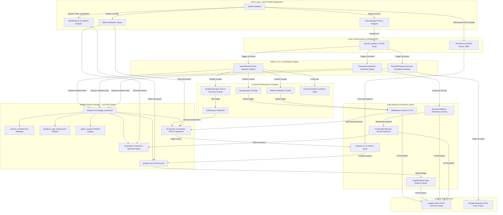

# ResearchBot: Autonomous Research Graph

[](https://developer.apple.com/macos/)
[](https://developer.apple.com/swift/)
[](https://www.python.org/)
[](LICENSE)

An academic gap-hunting and proposal synthesis engine designed to automate domain research for university-level Final Year Projects (FYP). The platform correlates societal needs, academic limitations, and knowledge-graph topologies to generate structured, source-verifiable academic proposals.

ResearchBot works by isolating each execution session, scraping real-time academic and social data, building interactive network graphs, running Map-Reduce topology analysis, and exporting natively formatted documents directly to Google Workspace.

---

## Architectural Overview

ResearchBot is split into a native macOS interface and a highly concurrent Python command-line engine. The frontend manages layouts, execution processes, and graph views, while the backend coordinates data ingestion, extraction, vector routing, and workspace synchronization.



---

## Research Implementation Pipeline

The Research Implementation Pipeline coordinates real-time data ingestion, open-access paper triaging, semantic entity extraction, and structural graph gap-hunting to isolate and diagnose academic limitations:

### Multi-Source Academic & Social Ingestion
The ingestion scraper pulls concurrently from Semantic Scholar, arXiv, and Tavily to build a multi-dimensional foundation for analysis. The scraper implements rate-pacing protocols, backoffs based on HTTP Retry-After headers, and an automatic circuit-breaker behavior that skips degraded endpoints while preserving successful threads.

### Open-Access PDF Triage
For all located papers featuring valid PDF URLs, ResearchBot executes a high-speed triage phase. Using Gemini 2.5 Flash, the engine filters up to 25 titles and abstracts, selects the top 5 most relevant targets, and pulls down full-document text via a PyMuPDF extraction pool.

### Interactive Knowledge Graphs
Ingested documents are compiled into structural visual networks using the Graphify entity-relation extraction framework. Graphify parses primary research documents into a typed graph schema using Llama 4 Scout (10M token context window) via the local FastAPI VertexProxy bridge. 

Network nodes are grouped via Louvain-style modular community clustering, programmatically named using Gemini 2.5 Flash, and rendered interactively inside the SwiftUI interface using the vis-network engine. The interface also exposes an interactive console connected directly to the VertexProxy API to calculate node paths and execute graph queries.

### Map-Reduce Topology Analyzer
The engine executes a parallel Map-Reduce topology analysis pipeline orchestrated with Python's asyncio framework and Gemini 2.5 Pro models. The analysis extracts key final-year project academic gaps using structural network algorithms combined with full-text source document books:

* **Structural Holes (Burt's Structural Holes Theory)**: The algorithm parses the modular communities of the network to locate bridging opportunities—disconnected or loosely-coupled sub-graphs that can be synthetically integrated to provide novel research contributions.
* **High-Degree Constraint Analysis (Degree Centrality)**: Computes edge counts and inbound citation weights for nodes classified as limitations or method weaknesses. Central constraints backed by multi-source primary evidence denote consensus technical bottlenecks.
* **Orphaned Solutions Detection**: Filters for solution nodes displaying outgoing edges to failure/drawback nodes but lacking integrated target-system relationships. These denote proven engineering components that have not yet been successfully applied to current bottlenecks.

### Advanced Corpus Allocation & Token Budgeting
To run deep-dive Map-Reduce analysis without hitting model limits or regional quota walls, ResearchBot implements a multi-tiered token gating and dynamic allocation pipeline. The system enforces a rigorous target budget of **180,000 characters** (approximately 45,000 to 60,000 tokens), leaving safe headroom for massive structural topologies, prompts, and system instructions:

* **Architectural File Filtering (Stage 1)**: Only files residing in `processed_summaries/` and `agent_scrapes/` are loaded. Raw web crawled indexes and unfiltered social media data residing in `raw_ingestion/` are completely skipped during topology and gap analysis.
* **Semantic Bookends Compression Algorithm (Stage 2)**: For individual files exceeding **60,000 characters**, ResearchBot executes an in-memory semantic compression process (`infrastructure/TextChunker.py`). The chunker detects Abstract/Introduction and Conclusion/Limitations sections via regular expressions, extracting and joining them with a marked break, and falls back to a structural 30k head/tail slice if section headers are missing.
* **Protected Dynamic Bucket Allocation (Stage 3)**: Mapped into synthesis summary (`40,000` chars), web scrape (`80,000` chars), and academic open-access PDF (`120,000` chars) protected character budgets.
* **Asymmetric Budget Rollover (Stage 4)**: Unused synthesis capacity rolls over to the Academic budget first, then to the Web Scrape budget. Files are packed as complete blocks to maintain document integrity.
* **Global Character Safety Net (Stage 5)**: If the merged corpus exceeds **180,000 characters**, an eviction algorithm drops files lowest-priority first (scrapes first, then full-text papers, never synthesis files).
* **Reference Hygiene Validation (Stage 6)**: If the model cites a document that did not survive the allocation filters, the citation reference is automatically scrubbed, preventing model hallucinations.

---

## Academic Project Proposal Engine

The Academic Project Proposal Engine leverages the diagnosed graph gaps to scope research queries, evaluate academic literature, and synthesize complete, formal academic project proposals:

### Deep Semantic Scoping & Expansion
When a user submits a research idea, the Proposal Orchestrator scopes the concept using Gemini 2.5 Flash against the active session's manifest history (`session_manifest.json`). It expands the idea into:
* A precision `scoped_query` defining the research Task, Domain, and Constraint.
* Exactly 5 highly specialized academic search statements targeting methodologies, limitations, and architectures.
* A 2-sentence `core_criteria` check used to score academic literature relevance.

### PDF Bookends Enrichment
The engine compiles a candidate paper pool from local scraped documents, full-text PDFs, and concurrent external Semantic Scholar and Tavily queries. For all candidate papers featuring valid PDF URLs, a background thread pool downloads the PDF and extracts the Abstract and Conclusion bookends using PyMuPDF and TextChunker, writing them to an enriched `abstract_conclusion` field capped at 8,000 characters.

### Rubric-Based Semantic Matching (SemanticMatcher.py)
The core literature validation and scoring logic resides in `infrastructure/SemanticMatcher.py`. The module is responsible for identifying relevant research and filtering out tangential literature:

* **Rubric Scoring (0-10 Scale)**: Gemini 2.5 Flash evaluates each paper's enriched Abstract + Conclusion context against the scoped `core_criteria` according to three strict dimensions:
  1. **Domain Alignment**: Does the paper operate in the same field or scientific domain?
  2. **Task Alignment**: Is the paper trying to solve a similar problem, task, or research gap (evaluating BOTH the Abstract's goals AND the Conclusion's actual achievements or limits)?
  3. **Method Relevance**: Is the methodology, technology, or approach relevant or applicable (evaluating the Conclusion's stated limitations as direct opportunities)?
* **Score Calculation**: The model calculates the total relevance percentage score in-memory using the formula: `(domain_alignment + task_alignment + method_relevance) / 30 * 100`.
* **Pydantic Validation**: Flash returns a structured JSON payload validating against the `RubricEvaluation` Pydantic schema, securing the scores and a 1-sentence reasoning justification.
* **Concurrency Lock**: To maximize throughput while avoiding rate-limiting boundaries, the scoring pipeline runs concurrently via `asyncio.gather` bounded by an `asyncio.Semaphore(5)` lock.
* **Quota Resilience & Failovers**: Scoring calls utilize `tenacity` retry wrappers with exponential backoffs (`Multiplier=2`, `Min=2s`, `Max=10s`) triggered exclusively on `429 ResourceExhausted` exceptions. If the primary `global` Vertex API endpoint exhausts its quota, the matcher cascades through a sharded stable region pool (`europe-west4`, `us-east4`, `asia-northeast1`, and `us-central1`).
* **Strict Filtering Threshold**: Only papers scoring **strictly > 75.0%** are retained. The top 15 highest-scoring papers are written to `matched_papers.json` to anchor the literature review.

### Automated Proposal Synthesis
Using Gemini 2.5 Pro, the engine synthesizes a highly structured academic project proposal. The proposal consumes the scoped definition, gap analysis, and matching papers, outputting to `proposals/proposal_*.md` conforming to a rigid Roman numeral academic template:
* **I. Executive Summary**: Compelling 2-3 paragraph problem statement and proposed novelty.
* **II. Project Definition**: Detailed constraints, Task, and Domain boundaries.
* **III. Matched Literature Review**: Critical assessment of top-scoring Open Access reference papers.
* **IV. Academic Gap Alignment**: Systematic alignment with diagnosed structural holes, limitations, and orphaned solutions.
* **V. Proposed Architecture & Methodology**: Separated systematically into *V.A Feature Set* and *V.B Technical Challenges*.
* **VI. Verification & Execution Plan**: Empirical evaluation strategy.

### Upgraded Workspace Docs Exporter
The Workspace Exporter (`GoogleWorkspaceManager.py`) converts the generated proposal markdown into a professional native Google Doc via OAuth 2.0 InstalledAppFlow:
* **Native Paragraph Parsing**: Converts markdown headers (H1-H3), regular text, and bold style ranges (`**text**`) into native Google Doc API formatting requests instead of dumping raw markdown characters.
* **Tabular Formatting**: Automatically parses Markdown tables into beautifully structured, natively styled Google Doc tables.
* **Clickable Literature References**: Matches papers in `matched_papers.json` and inserts direct academic hyperlinks to their original online source URLs (arXiv, Semantic Scholar, etc.) inside literature tables.
* **Reference Materials Section**: Appends a formal **"VII. Reference Materials"** section featuring bulleted links directly to original publications.

---

## Technical Prerequisites

To compile and execute ResearchBot, your local workstation requires:

| Component | Minimum Version | Installation Source / Note |
|-----------|-----------------|----------------------------|
| macOS | macOS Sonoma 14.0+ | Apple Silicon optimization supported |
| Xcode | Xcode 15.0+ | Required for SwiftUI compile targets |
| Python | Python 3.10+ | Primary backend processing |
| Firecrawl | Local Docker instance | Required for recursive web scraping |
| Graphify | Local CLI utility | Required for knowledge graph extraction |
| Google Cloud | Active Project | Required for Vertex AI API access |

---

## Getting Started

### 1. Backend Environment Setup
Navigate to the backend directory, create a virtual environment, and install package dependencies:

```bash
cd ResearchGraphApp/Backend
python3 -m venv .venv
source .venv/bin/activate
pip install -r requirements.txt
```

Create a `.env` configuration file at the repository root:

```env
GOOGLE_CLOUD_PROJECT_ID=your-gcp-project-id
TAVILY_API_KEY=your-tavily-api-key
SEMANTIC_SCHOLAR_API_KEY=optional-api-key
GRAPHIFY_TOKEN_BUDGET=8192
```

Ensure your local gcloud CLI is authenticated and Application Default Credentials (ADC) are generated:

```bash
gcloud auth application-default login
```

### 2. Launch Local Scraper & Proxy
Launch your local Firecrawl scraper inside its Docker environment, then initiate the VertexProxy helper script. This handles FastAPI endpoints and launches the background server on port 8000:

```bash
# Verify firecrawl docker status
docker compose -f ResearchGraphApp/Backend/infrastructure/firecrawl/docker-compose.yml up -d

# Start VertexProxy
./ResearchGraphApp/ensure_vertex_proxy.sh
```

### 3. SwiftUI App Compilation
Open the Swift project using Xcode:

```bash
open ResearchGraphApp/App/ResearchBot.xcodeproj
```

* Drag your Google Cloud OAuth client secrets (`credentials.json`) directly into the app bundle (`App/ResearchBot/credentials.json`).
* Select the **ResearchBot** scheme, set the target device to your local macOS workstation, and execute the Build & Run command (`Cmd + R`).

---

## Execution Interface & Command Line

The backend can be driven programmatically or tested using the execution wrapper `execute_pipeline.sh`:

### Run Ingestion Pipeline
```bash
./execute_pipeline.sh --idea "Decentralized episodic memory systems in multi-agent workflows"
```

### Run Proposal Synthesis
```bash
./execute_pipeline.sh --command generate_proposal \
  --session-id "session_20260525T004344Z_episodic_memory_analysis" \
  --project-idea "Provide localized vector memory capsules for time-travel state transitions"
```

### Run Google Workspace Export
```bash
./execute_pipeline.sh --command export_to_workspace \
  --session-id "session_20260525T004344Z_episodic_memory_analysis" \
  --kb-root "/Users/user/Documents/Dev/ResearchBot/research_knowledge_base"
```

---

## Backend Module Index

The Python backend is organized cleanly around UseCase abstractions and infrastructure providers:

```
Backend/
├── main.py                          # Unified CLI entrypoint
├── application/
│   ├── IngestSeedUseCase.py         # Main pipeline coordinator
│   ├── ExportWorkspaceUseCase.py    # Workspace exporter coordination
│   ├── InputAnalyzer.py             # Seed parsing and keyword extraction
│   ├── DataRefiner.py               # Gemini 2.5 Pro noise reduction
│   ├── AgentSynthesizer.py          # Abstract synthesis compiler
│   ├── GraphAnalyzer.py             # Map-Reduce topology calculations
│   ├── ProposalOrchestrator.py      # Scoping and paper matching coordinator
│   └── ProposalSynthesizer.py       # Roman numeral academic writer
└── infrastructure/
    ├── GoogleWorkspaceManager.py    # Native Google Docs formatting and OAuth
    ├── VertexProxy.py               # FastAPI proxy and local endpoint router
    ├── GraphifyRunner.py            # Graphify shell bridge and CLI manager
    ├── SemanticMatcher.py           # Gemini 2.5 Flash relevance validation
    ├── TextChunker.py               # Segment-based academic bookend compressor
    ├── FileStorage.py               # Session directories and file structures
    ├── WebScraper.py                # Firecrawl integration
    ├── SocialScraper.py             # Social leads fetcher
    ├── AcademicScraper.py           # arXiv, Semantic Scholar, and triage logic
    ├── PdfExtractor.py              # PyMuPDF processing
    └── WikiAPI.py                   # Contextual term definition crawler
```

---

## Isolated Workspace Layout

Every pipeline run operates with strict isolation. Data is written directly inside timestamped session folders within the knowledge base:

```
/research_knowledge_base/
└── runs/
    └── session_<UTC_TIMESTAMP>_<slug>/
        ├── agent_scrapes/         # Academic metadata, web scrapes, wiki, url refiners
        ├── raw_ingestion/         # Excluded social feeds (Phase 2.5 inputs only)
        ├── processed_summaries/   # Phase 3 summaries and Phase 2.2 full PDFs
        ├── graphify-out/          # Local Graphify outputs (json, html, reports)
        ├── proposals/             # Synthesized academic proposal markdown files
        ├── session_manifest.json  # Ingestion metrics and details
        └── academic_gap_analysis.json  # Persisted map-reduce payloads
```

---

## Detailed Environment Reference

The following environment variables control thresholds, timing parameters, and failovers across the system:

| Variable Name | Default Value | Role and Technical Description |
|---------------|---------------|--------------------------------|
| `GOOGLE_CLOUD_PROJECT_ID` | Required | Google Cloud project ID hosting your Vertex API resources. |
| `RESEARCHBOT_SESSION_DIR` | Auto-set | Absolute path to the active timestamped folder. Set at startup. |
| `GRAPHIFY_TOKEN_BUDGET` | `8192` | Budget allocations passed to the Graphify CLI compiler. |
| `S2_KEYWORD_DELAY_SEC` | `3` | Pacing delay between distinct Semantic Scholar API keyword calls. |
| `S2_POST_429_COOLDOWN_SEC` | `15` | Cooldown period applied after receiving an HTTP 429 rate limit. |
| `S2_429_MAX_RETRIES` | `2` | Number of attempts allowed for S2 calls after rate-limit backoffs. |
| `S2_CIRCUIT_BREAKER` | `true` | When true, skips S2 calls on subsequent keywords if a 429 is exhausted. |
| `ARXIV_REQUEST_DELAY_SEC` | `3` | Pacing delay between distinct arXiv atom query executions. |
| `ACADEMIC_TRIAGE_POOL_MAX` | `25` | Target quantity of Open Access papers sent to initial Flash triage. |
| `ACADEMIC_FULLTEXT_MAX_CHARS` | `100000` | Hard cap on characters extracted from a single open-access PDF. |
| `ACADEMIC_FULLTEXT_MAX_BYTES` | `52428800` | Maximum size limits (50 MB) allowed for triaged PDF downloads. |

---

## System Design & Bridging Contracts

### Session Isolation & Data Integrity
To preserve integrity, the core pipeline only loads files that land under explicit paths. Files under `raw_ingestion/` are excluded from Graphify and GraphAnalyzer tasks. All output paths must utilize the `RESEARCHBOT_SESSION_DIR` path environment, and temporary directory buffers must remain session-scoped.

### SwiftUI Stdout Communication
The SwiftUI frontend processes backend subprocess executions using specific boundary tags printed on stdout. This allows reliable asynchronous JSON decoding:

#### Ingestion Pipeline Finish Tag
```
---PIPELINE_RESULT_START---
{
  "status": "success",
  "message": "Completed pipeline execution successfully.",
  "graph_path": "/path/to/runs/session_xyz/graphify-out/graph.html",
  "kb_root": "/path/to/research_knowledge_base",
  "session_id": "session_xyz",
  "session_path": "/path/to/runs/session_xyz",
  "phase": "4.5",
  "seed_analysis": { ... },
  "saved_files": [ ... ],
  "synthesis_preview": "...",
  "graphify": { "ran": true, "stdout": "...", "error": null },
  "academic_gap_analysis": { ... }
}
---PIPELINE_RESULT_END---
```

#### Proposal Synthesis Finish Tag
```
---PROPOSAL_RESULT_START---
{
  "status": "success",
  "message": "Academic proposal compiled.",
  "proposal_path": "/path/to/proposals/proposal_123.md",
  "matched_papers_path": "/path/to/proposals/proposal_123_matched_papers.json",
  "session_id": "session_xyz",
  "scoped_query": "...",
  "matched_paper_count": 15,
  "proposal_id": "proposal_123"
}
---PROPOSAL_RESULT_END---
```

#### Workspace Export Finish Tag
```
---WORKSPACE_EXPORT_RESULT_START---
{
  "status": "success",
  "message": "Session documents exported to Google Drive.",
  "master_document_url": "https://docs.google.com/document/d/...",
  "topic_document_url": "https://docs.google.com/document/d/...",
  "topic_folder_url": "https://drive.google.com/drive/folders/...",
  "session_id": "session_xyz"
}
---WORKSPACE_EXPORT_RESULT_END---
```

### Rate-Limiting & Local Backoffs
API requests to upstream entities are isolated within distinct execution units. 429 exhaustion within a specific Map-Reduce task triggers regional sharding failovers only within that thread. Sibling processes continue without interruptions.

---

## Contributing Protocols

To contribute features or modify ResearchBot:
1. **Maintain Interface Boundaries**: All layout and SwiftUI operations belong in the frontend application. Script executions, web scraping, and API proxy routing belong in the Python backend. Do not bridge UI code and processing logic.
2. **Adhere to Session Rules**: All file writes and database states must target individual timestamped sessions under `/research_knowledge_base/runs/`. Do not perform global database updates or write files to root directories.
3. **No Direct Commits**: Do not run automated git commits or push code to remote branches without explicit developer review and verification. All changes must be manually approved and authorized.
