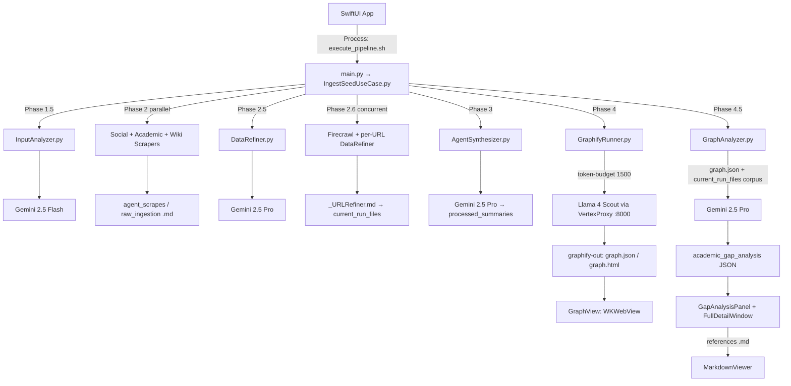

# Project Specification: Autonomous Research Graph (macOS)

## 1. Project Vision

An **Academic Gap-Hunting Engine** designed to automate deep-dive domain research for university-level Final Year Projects (FYP). The system identifies research opportunities by correlating:

* **Societal problems** (from social media and web discovery),
* **Academic limitations** (from peer-reviewed papers),
* **Knowledge-graph topology** (communities, high-degree nodes, and failure-linked solutions),

and surfaces **actionable FYP angles** with **source-verifiable citations** back to the original Markdown corpus.

Simply rendering a knowledge graph is not sufficient. Phase **4.5 (Academic Graph Analyzer)** actively guides students on *how* to read graph topology—structural holes, validated limitation nodes, and orphaned solutions—grounded in the full source text of the current pipeline run.

---

## 2. Technology Stack & Environment

| Layer | Technology |
|-------|------------|
| **Platform** | macOS (optimized for Apple Silicon) |
| **Frontend** | SwiftUI (`@Observable`), `WKWebView` (Graphify HTML), native Markdown viewer |
| **Backend** | Python 3.10+, subprocess bridge via `execute_pipeline.sh` → `main.py` |
| **Local proxy** | `VertexProxy.py` (FastAPI on port 8000) — OpenAI-compatible bridge to Vertex AI for Graphify / Llama 4 Scout |

### AI Models

| Model | Role |
|-------|------|
| **Gemini 2.5 Flash** | Phase 1.5 input analysis; Phase 2.6 high-value URL extraction |
| **Gemini 2.5 Pro** | Phase 2.5 noise refinement; Phase 3 synthesis; **Phase 4.5 full-corpus gap analysis** |
| **Llama 4 Scout** | Phase 4 knowledge-graph extraction (10M context via VertexProxy) |

### Data Ingestion APIs

* **Firecrawl** — Local Docker container for deep web crawling (`/crawl`, `/scrape`)
* **Semantic Scholar API** — Academic citations, limitations, future work
* **Tavily API** — Social leads (Reddit/X) and academic fallbacks
* **MediaWiki API** — Foundational definitions and Wiki context

---

## 3. Core Architecture & Data Flow

The system operates as a recursive, concurrent pipeline with **strict session isolation**. Each run builds an in-memory `current_run_files` queue (absolute `Path` objects) that feeds Phase 4 Graphify and Phase 4.5 analysis—never mixing artifacts from prior runs.



### Execution Bridge

```
SwiftUI (PythonBridge)
    └── bash execute_pipeline.sh [--idea "..."]
            ├── Activates Backend/.venv
            ├── Starts VertexProxy (uvicorn :8000) if not running
            └── python3 main.py → IngestSeedUseCase.execute()
                    └── stdout: PROGRESS lines + ---PIPELINE_RESULT_START--- JSON
```

---

## 4. Pipeline Phases (Backend)

### Phase 1 & 1.5: Ingestion & Intent Analysis

| Item | Detail |
|------|--------|
| **Entry** | `InputAnalyzer.analyze_seed(raw_seed)` |
| **Model** | Gemini 2.5 Flash (global + `STABLE_REGIONS` failover) |
| **Outputs** | `core_context`, `search_keywords`, `extracted_urls`, `user_intent` |
| **Swift input** | User topic via `--idea`; optional `--url` appended to seed |

### Phase 2: Discovery Scraping (Concurrent)

| Scraper | Module | Output location |
|---------|--------|-----------------|
| Firecrawl (sequential first) | `WebScraper.py` | `agent_scrapes/` |
| Social (parallel) | `SocialScraper.py` | `raw_ingestion/` |
| Academic (parallel) | `AcademicScraper.py` | `agent_scrapes/` |
| Wiki (parallel) | `WikiAPI.py` | `agent_scrapes/` |

* **Concurrency:** `ThreadPoolExecutor` with `_PHASE2_WORKERS = 3`
* Every saved scrape is appended to `current_run_files` via `path.resolve()`

### Phase 2.5: Noise Reduction & Primary Refinement

| Item | Detail |
|------|--------|
| **Module** | `DataRefiner.refine_scraped_data(raw_corpus)` |
| **Model** | Gemini 2.5 Pro (`max_output_tokens=65536`) |
| **Input** | In-memory corpus only: `web_md`, `social_md`, `wiki_md`, `academic_md`, `deep_crawl_md` |
| **Output** | Clean Markdown research ledger; section **"High-Value URLs for Next Crawl Phase"** |
| **Failure** | `RuntimeError` on regional exhaustion → orchestrator skips corrupt file write |

### Phase 2.6: Recursive Deep-Crawl & URL Refinement

| Item | Detail |
|------|--------|
| **URL extraction** | Gemini 2.5 Flash parses Phase 2.5 output → `Title [URL]` lines |
| **Per-URL worker** | `deep_crawl_urls` → `refine_scraped_data` → `save_markdown(..., *_URLRefiner)` |
| **Concurrency** | `ThreadPoolExecutor`, `_PHASE26_MAX_WORKERS = 5`, `threading.Lock` on `current_run_files` |
| **Anti-bot guard** | Skips payloads containing captcha / 403 / empty-scrape indicators |
| **Naming** | Files use `_URLRefiner` suffix for Phase 4 visibility |

### Phase 3: Synthesis & Storage

| Item | Detail |
|------|--------|
| **Module** | `AgentSynthesizer.synthesize_context(full_context)` |
| **Context contract** | **Only** `core_context` + `user_intent` + `refined_data` (no disk re-reads) |
| **Rubric sections** | Problem Background, Existing Solutions, Methodological Weaknesses (The Gap), Proposed Novelty |
| **Output** | `processed_summaries/<topic>_<timestamp>.md` → registered in `current_run_files` |

### Phase 4: Knowledge Graph Generation (Micro-Extraction Protocol)

| Item | Detail |
|------|--------|
| **Module** | `GraphifyRunner.run_graphify(current_run_files)` |
| **Session isolation** | Temp dir `temp_graph_input/` with only current-run refined Markdown |
| **Inclusion rules** | Academic refinement summary, `processed_summaries`, `# Wiki:` / `# Wikipedia:` headers, `*_URLRefiner.md` |
| **Extraction** | Graphify CLI via `OLLAMA_BASE_URL=http://localhost:8000` → VertexProxy → **Llama 4 Scout** |
| **Token budget** | `--token-budget 1500` (micro-chunking for granular node/edge extraction) |
| **Post-processing** | Resizable sidebar injection in `graph.html`; Gemini 2.5 Flash community naming patched into `graph.json` + `graph.html` |
| **Artifacts** | Moved to `research_knowledge_base/graphify-out/` |

**Graphify outputs:**

| File | Purpose |
|------|---------|
| `graph.json` | Full node/link/community data (Phase 4.5 input) |
| `graph.html` | Interactive visualization (Swift `WKWebView`) |
| `GRAPH_REPORT.md` | Structural report for agents / manual review |

**`graph.json` structure (relevant fields):**

```json
{
  "nodes": [
    { "id": "...", "label": "...", "community": 0, "community_name": "...", "type": "..." }
  ],
  "links": [
    { "source": "...", "target": "...", "type": "..." }
  ]
}
```

### Phase 4.5: Academic Graph Topology Analysis (Full-Corpus)

| Item | Detail |
|------|--------|
| **Module** | `GraphAnalyzer.analyze_graph_topology(current_run_files, graph_json_path=None)` |
| **Trigger** | `IngestSeedUseCase` after successful Phase 4 only |
| **Model** | Gemini 2.5 Pro (`response_mime_type=application/json`, `max_output_tokens=16384`) |
| **Inputs** | (A) Complete `graph.json` topology — **all nodes, all edges, all communities** (no artificial truncation). (B) Full Markdown corpus from `current_run_files` under `--- SOURCE DOCUMENTS ---` |
| **Per-file safety** | `_MAX_CHARS_PER_FILE = 120_000` tail-trim only for extreme single-file outliers |
| **Failover** | global → `STABLE_REGIONS` (same pool as DataRefiner / VertexProxy) |
| **Reference hygiene** | `_sanitize_references()` drops any filename not present in the loaded corpus |

**Three academic indicators the LLM must evaluate:**

1. **Structural Holes** — Loosely connected or disconnected communities; bridging FYP opportunities.
2. **High-Degree Limitation Nodes** — Limitation/challenge nodes with multi-source incoming evidence.
3. **Orphaned Solutions** — Solution nodes with outgoing edges to failure/drawback conditions.

**Prompt sections sent to Gemini:**

```
_TOPOLOGY_PROMPT
--- GRAPH TOPOLOGY ---   (full _build_topology_summary)
--- SOURCE DOCUMENTS --- (<<<FILE: name>>> ... <<<END FILE>>> blocks)
```

---

## 5. Knowledge Base Layout

```
/research_knowledge_base/          # Sibling to Backend/ (resolved by FileStorage.get_kb_root())
├── raw_ingestion/                 # Social scraper dumps (Reddit/X, etc.)
├── agent_scrapes/                 # Web, Wiki, Academic, URLRefiner, Phase 2.5 refinement
├── processed_summaries/             # Phase 3 synthesis Markdown
└── graphify-out/                  # Phase 4 artifacts (gitignored in repo root .gitignore)
    ├── graph.json
    ├── graph.html
    └── GRAPH_REPORT.md
```

Historical ledgers are preserved unless the user explicitly requests cleanup (`clean_kb.sh`).

---

## 6. Swift Bridging Contract

### Stdout markers

Python prints the final payload between:

```
---PIPELINE_RESULT_START---
{ ... JSON ... }
---PIPELINE_RESULT_END---
```

Live progress lines (`PROGRESS: Phase X — ...`) are streamed to the Swift console during execution.

### Success payload schema (`main.py` / `IngestSeedUseCase`)

| Key | Type | Description |
|-----|------|-------------|
| `status` | string | `"success"` or `"error"` |
| `message` | string | Human-readable result |
| `graph_path` | string | Absolute path to `graphify-out/graph.html` |
| `kb_root` | string | Absolute path to `research_knowledge_base/` (for Markdown resolution) |
| `phase` | string | Last completed phase label |
| `seed_analysis` | object | `core_context`, `search_keywords`, `extracted_urls`, `user_intent` |
| `saved_files` | string[] | All artifact paths written this run |
| `synthesis_preview` | string | First 500 chars of Phase 3 synthesis |
| `graphify` | object | `{ ran, stdout, error }` |
| `academic_gap_analysis` | object | Phase 4.5 structured insights (see below) |

### `academic_gap_analysis` schema

```json
{
  "summary": "Executive summary (3–5 sentences)",
  "structural_holes": [
    {
      "title": "string",
      "communities_involved": ["string"],
      "description": "string",
      "bridging_opportunity": "string",
      "references": ["exact_filename.md"]
    }
  ],
  "high_degree_limitations": [
    {
      "title": "string",
      "node_labels": ["string"],
      "degree": 0,
      "description": "string",
      "evidence": "string",
      "references": ["exact_filename.md"]
    }
  ],
  "orphaned_solutions": [
    {
      "title": "string",
      "failure_conditions": ["string"],
      "description": "string",
      "technical_contribution": "string",
      "references": ["exact_filename.md"]
    }
  ],
  "source_files": ["all filenames provided to the LLM"],
  "error": "optional string if analysis partially failed"
}
```

On Graphify failure, the orchestrator still returns a valid object with empty category arrays and an `error` message so Swift decoding never breaks.

---

## 7. SwiftUI Frontend Architecture

**Boundary rule:** Swift handles layout, navigation, process spawning, and file display only. No scraping, no LLM calls, no graph extraction in Swift.

### Module map

| File | Responsibility |
|------|----------------|
| `ResearchBotApp.swift` | App entry |
| `ContentView.swift` | `InputView` ↔ `GraphView` navigation |
| `PythonBridge.swift` | `Process()` → `execute_pipeline.sh`; parses `PipelineResult` |
| `GapAnalysisPanel.swift` | Concise right-side summary (metrics + CTA) |
| `FullDetailWindow.swift` | Sheet: full gap breakdown + reference navigation |
| `MarkdownViewer.swift` | Native Markdown reader for source verification |

### Screen flow

```
InputView
  └── Run Research → PythonBridge.runPipeline(idea:)
        └── on graph_path + success → GraphView

GraphView (HSplitView)
  ├── GraphWebView (WKWebView → graph.html + sibling assets)
  └── GapAnalysisPanel
        ├── Executive summary
        ├── Metric chips (hole / limitation / orphaned counts)
        └── "View Full Analysis" → .sheet(FullDetailWindow)

FullDetailWindow (NavigationStack)
  ├── Category cards with references as clickable capsules
  ├── Indexed Sources footer
  └── on reference tap → MarkdownViewer (in-place push)

MarkdownViewer
  ├── Resolves filename under kb_root (recursive search)
  ├── Lightweight MarkdownParser (headings, bullets, code, quotes)
  ├── Toolbar: Back → FullDetailWindow, Reveal in Finder
```

### `PythonBridge` observable state

| Property | Source |
|----------|--------|
| `isRunning` | Process lifecycle |
| `progress` | Accumulated stdout |
| `graphFilePath` | `graph_path` |
| `kbRoot` | `kb_root` |
| `academicGapAnalysis` | `academic_gap_analysis` |
| `synthesisPreview` | `synthesis_preview` |
| `errorMessage` | `status == "error"` or decode failure |

### Codable models (`GapAnalysisPanel.swift`)

* `AcademicGapAnalysis` — root payload
* `StructuralHole`, `HighDegreeLimitation`, `OrphanedSolution` — category entries with optional `references: [String]`

---

## 8. Python Backend Module Map

```
Backend/
├── main.py                          # CLI entry; PIPELINE_RESULT envelope
├── application/
│   ├── IngestSeedUseCase.py         # Orchestrator (Phases 1.5 → 4.5)
│   ├── InputAnalyzer.py             # Phase 1.5
│   ├── DataRefiner.py               # Phase 2.5
│   ├── AgentSynthesizer.py          # Phase 3
│   └── GraphAnalyzer.py             # Phase 4.5 (full-corpus)
└── infrastructure/
    ├── VertexProxy.py               # FastAPI :8000; Llama 4 Scout + pinned Gemini routing
    ├── GraphifyRunner.py            # Phase 4 shell + post-process
    ├── FileStorage.py               # KB paths, save_markdown, get_kb_root
    ├── WebScraper.py                # Firecrawl
    ├── SocialScraper.py
    ├── AcademicScraper.py
    └── WikiAPI.py
```

**Root scripts (ResearchGraphApp/):**

| Script | Role |
|--------|------|
| `execute_pipeline.sh` | venv activate, VertexProxy lifecycle, `main.py "$@"` |
| `run.sh` | Environment bootstrap |
| `clean_kb.sh` | Deep-clean inner KB files (preserves top-level folders) |
| `test_backend.sh` | Backend smoke tests |

---

## 9. Performance & High-Availability Protocols

### Multi-Region Failover (`STABLE_REGIONS`)

Used by `VertexProxy` (pinned models), `DataRefiner`, `AgentSynthesizer`, `InputAnalyzer` (URL extraction), `IngestSeedUseCase`, and **`GraphAnalyzer`**.

Primary: `global` → sequential failover:

* `europe-west4`
* `us-east4`
* `asia-northeast1`
* `us-central1`

**Pinned models** (`gemini-2.5-pro`, `llama-4-scout`) are never pool-rotated in VertexProxy.

### Concurrency

| Phase | Mechanism | Workers |
|-------|-----------|---------|
| 2 | `ThreadPoolExecutor` | 3 (Social, Academic, Wiki) |
| 2.6 | `ThreadPoolExecutor` + `Lock` | 5 |

### Rate-limit & fail-fast

* DataRefiner exhaustion → `RuntimeError` → orchestrator skips corrupt markdown writes
* GraphAnalyzer exhaustion → empty analysis payload with `error` string; graph still loads in UI

---

## 10. Development & Contribution Rules

### Code generation rules

1. **Strict separation** — Swift: UI + `Process` management. Python: APIs, scraping, LLM, Graphify, gap analysis. Do not mix environments.
2. **SwiftUI state** — Use `@Observable` on `PythonBridge`. Stream stdout for live console in `InputView`.
3. **No unapproved commits** — No `git commit` or `git push` without explicit user authorization in chat.

### Graphify integration rules

1. **Report monitoring** — Consult `graphify-out/GRAPH_REPORT.md` for structural holes and central nodes before advising on literature positioning.
2. **Incremental updates** — Run `graphify update` locally for structural additions without re-running extraction.

### Phase 4.5 / gap-analysis rules

1. **Corpus fidelity** — Always pass `current_run_files` from the orchestrator; never analyze stale disk files outside the run queue.
2. **Reference integrity** — Only filenames actually loaded in `_load_source_corpus` may appear in `references`; Python sanitizes LLM output before bridging.
3. **UI layering** — Summary metrics in `GapAnalysisPanel`; deep content and source links in `FullDetailWindow` + `MarkdownViewer`.

### File system integrity

1. **Folder preservation** — Clean utilities preserve top-level KB architecture.
2. **No data deletion** — Do not purge historical research ledgers unless explicitly requested.

---

## 11. Environment & Prerequisites

| Requirement | Notes |
|-------------|-------|
| `GOOGLE_CLOUD_PROJECT_ID` | Vertex AI / Gemini (ADC) |
| `.env` at repo root | Loaded by Backend modules and `execute_pipeline.sh` |
| `Backend/.venv` | Created via `run.sh` |
| VertexProxy on `:8000` | Auto-started by `execute_pipeline.sh` |
| Firecrawl Docker | Phase 2 / 2.6 crawling |
| Graphify CLI | Phase 4 (`ollama` backend pointed at VertexProxy) |
| Xcode 26+ | macOS app target `ResearchBot` |

Optional: `BRIDGE_SCRIPT_PATH` env var overrides `execute_pipeline.sh` location for Xcode schemes.

---

## 12. Quick Reference: Phase → File → Output

| Phase | Primary module | Key output |
|-------|----------------|------------|
| 1.5 | `InputAnalyzer.py` | Seed analysis JSON (in-memory) |
| 2 | Scrapers + `WebScraper` | `*.md` in `agent_scrapes` / `raw_ingestion` |
| 2.5 | `DataRefiner.py` | Refined ledger `.md` |
| 2.6 | `IngestSeedUseCase` workers | `*_URLRefiner.md` |
| 3 | `AgentSynthesizer.py` | `processed_summaries/*.md` |
| 4 | `GraphifyRunner.py` | `graphify-out/graph.{json,html}` |
| 4.5 | `GraphAnalyzer.py` | `academic_gap_analysis` in PIPELINE_RESULT |
| UI | `ContentView` + panels | Graph + gap summary + source viewer |
