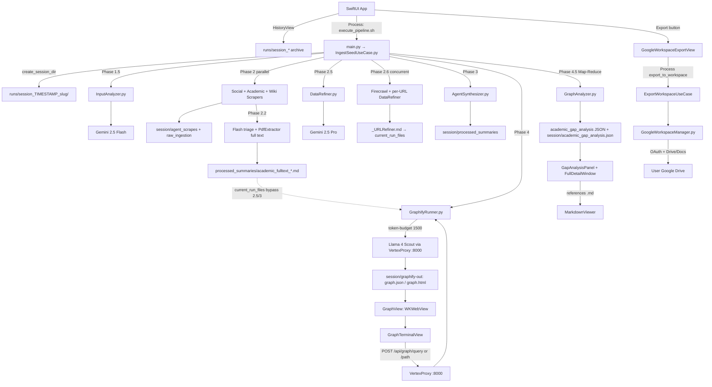

# Project Specification: Autonomous Research Graph (macOS)

## 1. Project Vision

An **Academic Gap-Hunting Engine** designed to automate deep-dive domain research for university-level Final Year Projects (FYP). The system identifies research opportunities by correlating:

* **Societal problems** (from social media and web discovery),
* **Academic limitations** (from peer-reviewed papers),
* **Knowledge-graph topology** (communities, high-degree nodes, and failure-linked solutions),

and surfaces **actionable FYP angles** with **source-verifiable citations** back to the original Markdown corpus.

Simply rendering a knowledge graph is not sufficient. Phase **4.5 (Academic Graph Analyzer)** actively guides students on *how* to read graph topology—structural holes, validated limitation nodes, and orphaned solutions—grounded in the full source text of the current pipeline run.

The workbench also provides **workspace run isolation** (every execution writes to a dedicated timestamped folder), an **interactive Graph Explorer Console** (`graphify query` / `graphify path`) for live topology interrogation against any historical session, and **Google Workspace Export** — a post-pipeline action that pushes each run’s Markdown corpus and Phase 4.5 gap analysis into the user’s personal Google Drive via **OAuth 2.0 Desktop App** flow (not a service account).

---

## 2. Technology Stack & Environment

| Layer | Technology |
|-------|------------|
| **Platform** | macOS (optimized for Apple Silicon) |
| **Frontend** | SwiftUI (`@Observable`), `WKWebView` (Graphify HTML), native Markdown viewer, `URLSession` → VertexProxy graph APIs |
| **Backend** | Python 3.10+, subprocess bridge via `execute_pipeline.sh` → `main.py` |
| **Local proxy** | `VertexProxy.py` (FastAPI on port 8000) — OpenAI-compatible bridge to Vertex AI; hosts `/api/graph/*` interactive endpoints |
| **Google Workspace** | `google-api-python-client`, `google-auth-oauthlib`, `google-auth` — Drive + Docs APIs; OAuth desktop flow writes to the signed-in user’s Drive |

### AI Models

| Model | Role |
|-------|------|
| **Gemini 2.5 Flash** | Phase 1.5 input analysis; **Phase 2.2 academic full-text triage**; Phase 2.6 high-value URL extraction; post-Graphify community naming |
| **Gemini 2.5 Pro** | Phase 2.5 noise refinement; Phase 3 synthesis; **Phase 4.5 Map-Reduce gap analysis** (3 parallel category calls + executive summary) |
| **Llama 4 Scout** | Phase 4 knowledge-graph extraction (10M context via VertexProxy) |

### Data Ingestion APIs

* **Firecrawl** — Local Docker container for deep web crawling (`/crawl`, `/scrape`)
* **Semantic Scholar API** — Academic Graph `/paper/search` (primary academic metadata in Phase 2); optional `SEMANTIC_SCHOLAR_API_KEY` via `x-api-key` header (keyless fallback with User-Agent)
* **arXiv API** — Atom export API (`export.arxiv.org`) for CS/FYP preprints; rate-paced multi-keyword queries
* **Tavily API** — Social leads (Reddit/X); academic domain search on `arxiv.org`, `researchgate.net`, `scholar.google.com` (merged with S2 + arXiv in `AcademicScraper.py`)
* **MediaWiki API** — Foundational definitions and Wiki context
* **PyMuPDF (`pymupdf`)** — In-memory PDF text extraction via `PdfExtractor.py` (partial pages for legacy path; **full document** for Phase 2.2 triage)

### Google Workspace (Export)

| Item | Detail |
|------|--------|
| **Auth model** | OAuth 2.0 Desktop (`InstalledAppFlow`) — end-user consent; **not** a service account |
| **Client secrets** | `credentials.json` bundled in the macOS app (`App/ResearchBot/credentials.json`, gitignored) |
| **Token storage** | `~/Library/Application Support/ResearchBot/token.json` (persisted after first browser login) |
| **Scopes** | `drive`, `documents` |
| **Drive layout** | Per-run topic folder + shared **Master Tracking Document** at Drive root |

---

## 3. Core Architecture & Data Flow

The system operates as a recursive, concurrent pipeline with **strict session isolation**. Each run:

1. Allocates a dedicated directory under `research_knowledge_base/runs/session_<TIMESTAMP>_<slug>/`
2. Pins that absolute path in `RESEARCHBOT_SESSION_DIR` for the lifetime of the process
3. Builds an in-memory `current_run_files` queue (absolute `Path` objects) for the active run—never mixing artifacts from prior runs. **Phase 4** and **Phase 4.5** each apply their own inclusion filters on this queue (see Phase 4 / 4.5); e.g. `raw_ingestion/` is queued for traceability but excluded from both graph and gap corpus



### Execution Bridge

```
SwiftUI (PythonBridge)
    ├── HistoryView — enumerate runs/session_* on disk; load historical graph + gap JSON
    ├── InputView — runPipeline(idea:) → Process
    ├── GraphTerminalView — URLSession POST → VertexProxy /api/graph/query|path
    └── exportToWorkspace(sessionId:kbRoot:) → Process (export command)

execute_pipeline.sh [--idea "..."] [--url "..."]
    ├── Activates Backend/.venv
    ├── Starts VertexProxy (uvicorn :8000) if not running
    └── python3 main.py [args]
            ├── Default: IngestSeedUseCase.execute()
            │       ├── FileStorage.create_session_dir(idea)  → RESEARCHBOT_SESSION_DIR
            │       └── stdout: PROGRESS lines + ---PIPELINE_RESULT_START--- JSON
            └── --command export_to_workspace --session-id ... --kb-root ...
                    └── ExportWorkspaceUseCase → ---WORKSPACE_EXPORT_RESULT_START--- JSON
```

---

## 4. Pipeline Phases (Backend)

All on-disk outputs below are relative to the **active session directory**:

`research_knowledge_base/runs/session_<UTC_TIMESTAMP>_<slug>/`

### Phase 1 & 1.5: Ingestion & Intent Analysis

| Item | Detail |
|------|--------|
| **Entry** | `InputAnalyzer.analyze_seed(raw_seed)` |
| **Model** | Gemini 2.5 Flash (global + `STABLE_REGIONS` failover) |
| **Outputs** | `core_context`, `search_keywords`, `extracted_urls`, `user_intent` (in-memory only until later phases write files) |
| **Swift input** | User topic via `--idea`; optional `--url` appended to seed |

### Phase 2: Discovery Scraping (Concurrent)

| Scraper | Module | Output location (within session) |
|---------|--------|----------------------------------|
| Firecrawl (sequential first) | `WebScraper.py` | `agent_scrapes/` |
| Social (parallel) | `SocialScraper.py` | `raw_ingestion/` (queued on `current_run_files`; **excluded** from Phase 4 Graphify and Phase 4.5 — social signal reaches the graph only via Phase 2.5 refined ledger) |
| Academic (parallel) | `AcademicScraper.py` — see **Academic discovery** below | `agent_scrapes/academic_scrape.md` |
| Wiki (parallel) | `WikiAPI.py` | `agent_scrapes/` |

* **Orchestrator input:** `search_academic_papers(search_keywords)` receives the full Phase 1.5 keyword list (not only `primary_keyword`).
* **Concurrency:** `ThreadPoolExecutor` with `_PHASE2_WORKERS = 3` (Social, Academic, Wiki). Academic thread also runs **Phase 2.2** internally before returning.
* Every saved scrape is appended to `current_run_files` via `path.resolve()`.
* **Web / Social / Wiki:** `save_markdown(subdir_key, topic, content, session_dir=...)`.
* **Academic metadata:** written to fixed path `agent_scrapes/academic_scrape.md` (abstracts/titles only — no embedded PDF excerpts).

#### Academic discovery (`AcademicScraper.py`)

Multi-keyword expansion uses the **top 3** unique `search_keywords` per source:

| Source | Per keyword | Post-merge |
|--------|-------------|------------|
| **Semantic Scholar** | 10 papers (`/paper/search`) | Dedupe by `paperId` / normalized title |
| **arXiv** | 10 papers (Atom API) | Dedupe by arXiv ID; `ARXIV_REQUEST_DELAY_SEC` (default 3s) between keyword calls |
| **Tavily** (academic domains) | 5 results | Dedupe by URL |

**Cross-source deduplication:** arXiv and Tavily rows that match an existing S2 paper (arXiv ID or title) are dropped so the metadata scrape does not duplicate the same work.

**Return type:** `AcademicSearchResult` dataclass:

```python
@dataclass
class AcademicSearchResult:
    markdown: str                      # metadata-only corpus for agent_scrapes/
    fulltext_artifacts: list[FullTextArtifact]  # Phase 2.2 payloads for processed_summaries/
```

Each `FullTextArtifact` carries `triage_id`, `title`, `url`, `pdf_url`, `body` (full text), and `source`.

### Phase 2.2: Academic Full-Text Triage (inside Academic thread)

Runs **after** metadata merge, **before** Phase 2.5. Full-text papers bypass `DataRefiner` and are registered in `current_run_files` for **Phase 4** and **Phase 4.5** only (not Phase 3 synthesis).

| Step | Detail |
|------|--------|
| **1. OA pool** | All deduped papers with a non-empty `pdf_url` (S2 `openAccessPdf`, arXiv `/pdf/` links, arXiv abs URLs normalized) |
| **2. Pool cap** | Citation-sorted; max `ACADEMIC_TRIAGE_POOL_MAX` (default 25) sent to Flash |
| **3. Triage** | `triage_top_papers()` — Gemini 2.5 Flash (`genai.Client`, global + `STABLE_REGIONS` failover) |
| **Prompt contract** | Evaluate titles/abstracts vs keywords; **only** papers with `pdf_url`; return JSON array of exact `triage_id` strings (`s2:…`, `arxiv:…`, `url:…`) |
| **4. Selection** | Up to 5 Flash picks; **backfill** from remaining OA pool if a download fails |
| **5. Full PDF I/O** | `ThreadPoolExecutor` (`_PDF_EXTRACT_WORKERS = 5`); `PdfExtractor.extract_full_text_from_url` (all pages) |
| **6. Persist** | Orchestrator writes `processed_summaries/academic_fulltext_{triage_id}_{timestamp}.md` |

**Stdout examples:**

```
PROGRESS: Phase 2.2 — triaging 22 OA candidates (max pool 25)...
PROGRESS: Phase 2.2 — Flash selected 5 papers for full-text review.
PROGRESS: Phase 2.2 — fetching full text for up to 5 papers (5 unique PDFs, 5 workers)...
PROGRESS: Phase 2.2 — full-text [3/5] ok: https://arxiv.org/pdf/...
PROGRESS: Phase 2.2 — saving 5 full-text papers to processed_summaries/ (DataRefiner bypass)...
PROGRESS: Phase 2.2 — saved academic_fulltext_arxiv_1706_03762_20260522T120000.md
```

#### `PdfExtractor.py`

| Function | Mode | Limits |
|----------|------|--------|
| `extract_text_from_url` | First + last 3 pages (legacy / optional) | `ACADEMIC_PDF_MAX_CHARS` (default 12k), `ACADEMIC_PDF_MAX_BYTES` (25 MB) |
| `extract_full_text_from_url` | **Every page** (Phase 2.2) | `ACADEMIC_FULLTEXT_MAX_CHARS` (default 100k), `ACADEMIC_FULLTEXT_MAX_BYTES` (50 MB) |

Both use `requests` with `timeout=(5, 15)` (connect 5s, read 15s), in-memory download, thread-safe PyMuPDF parsing. Failures return `""` and never crash the worker pool.

### Phase 2.5: Noise Reduction & Primary Refinement

| Item | Detail |
|------|--------|
| **Module** | `DataRefiner.refine_scraped_data(raw_corpus)` |
| **Model** | Gemini 2.5 Pro (`max_output_tokens=65536`) |
| **Input** | In-memory corpus only: `web_md`, `social_md`, `wiki_md`, `academic_md` (metadata from `academic_scrape.md`), `deep_crawl_md` — **excludes** Phase 2.2 `academic_fulltext_*.md` |
| **Output** | Clean Markdown research ledger in `agent_scrapes/`; section **"High-Value URLs for Next Crawl Phase"** |
| **Failure** | `RuntimeError` on regional exhaustion → orchestrator skips corrupt file write |

### Phase 2.6: Recursive Deep-Crawl & URL Refinement

| Item | Detail |
|------|--------|
| **URL extraction** | Gemini 2.5 Flash parses Phase 2.5 output → `Title [URL]` lines |
| **Per-URL worker** | `deep_crawl_urls` → `refine_scraped_data` → `save_markdown(..., *_URLRefiner, session_dir=...)` |
| **Concurrency** | `ThreadPoolExecutor`, `_PHASE26_MAX_WORKERS = 5`, `threading.Lock` on `current_run_files` |
| **Anti-bot guard** | Skips payloads containing captcha / 403 / empty-scrape indicators |
| **Naming** | Files use `_URLRefiner` suffix for Phase 4 visibility and HistoryView metrics |

### Phase 3: Synthesis & Storage

| Item | Detail |
|------|--------|
| **Module** | `AgentSynthesizer.synthesize_context(full_context)` |
| **Context contract** | **Only** `core_context` + `user_intent` + `refined_data` (no disk re-reads; **no** Phase 2.2 full-text files) |
| **Rubric sections** | Problem Background, Existing Solutions, Methodological Weaknesses (The Gap), Proposed Novelty |
| **Output** | `processed_summaries/<topic>_<timestamp>.md` (Phase 3 synthesis) → registered in `current_run_files` |

### Phase 4: Knowledge Graph Generation (Micro-Extraction Protocol)

| Item | Detail |
|------|--------|
| **Module** | `GraphifyRunner.run_graphify(current_run_files, session_dir=...)` |
| **Session isolation** | Temp dir `session_dir/temp_graph_input/` with only current-run refined Markdown; artefacts land in `session_dir/graphify-out/` |
| **Inclusion rules** | Academic refinement summary, **all** `processed_summaries/` (Phase 3 synthesis + `academic_fulltext_*.md`), `# Wiki:` / `# Wikipedia:` headers, `*_URLRefiner.md`, `agent_scrapes` refinement outputs |
| **Extraction** | Graphify CLI via `OLLAMA_BASE_URL=http://localhost:8000/v1` → VertexProxy → **Llama 4 Scout** |
| **Token budget** | `--token-budget` from `GRAPHIFY_TOKEN_BUDGET` env (default `8192`) |
| **Post-processing** | Resizable sidebar injection in `graph.html`; Gemini 2.5 Flash community naming patched into `graph.json` + `graph.html` |
| **Artifacts** | `session_dir/graphify-out/` only — never the legacy shared root |
| **Phase 4.5 alignment** | Graphify never reads `raw_ingestion/`; Phase 4.5 uses the same directory gate (`processed_summaries/` + `agent_scrapes/` only) so topology and gap citations stay consistent |

**Graphify outputs (per session):**

| File | Purpose |
|------|---------|
| `graph.json` | Full node/link/community data (Phase 4.5 input) |
| `graph.html` | Interactive visualization (Swift `WKWebView`) |
| `GRAPH_REPORT.md` | Structural report for agents / manual review |

**`graph.json` structure (relevant fields):**

```json
{
  "nodes": [
    { "id": "...", "label": "...", "community": 0, "community_name": "...", "type": "..." }
  ],
  "links": [
    { "source": "...", "target": "...", "type": "..." }
  ]
}
```

### Phase 4.5: Academic Graph Topology Analysis (Map-Reduce, Full-Corpus)

Phase 4.5 avoids a single monolithic Gemini call over the full graph + corpus (high latency and regional burst quotas). Instead it uses **async Map-Reduce**: three specialized category analyses run in parallel, then a lightweight fourth call merges an executive summary.

| Item | Detail |
|------|--------|
| **Module** | `GraphAnalyzer.analyze_graph_topology(current_run_files, graph_json_path=...)` |
| **Graph input** | `session_dir/graphify-out/graph.json` (passed explicitly by orchestrator) |
| **Entry** | Sync wrapper; inner orchestration via `asyncio.run(_run_map_reduce_analysis_async(...))` |
| **Trigger** | `IngestSeedUseCase` after Phase 4 (runs even when Graphify fails or returns a sparse graph; uses document topology fallback) |
| **Model** | Gemini 2.5 Pro (`response_mime_type=application/json`) |
| **Inputs** | (A) Complete `graph.json` topology — **all nodes, all edges, all communities** (no artificial truncation). (B) Markdown corpus under `--- SOURCE DOCUMENTS ---` (see **Corpus alignment** below) |
| **Corpus I/O** | `_load_source_corpus_async()` — concurrent per-file reads via `asyncio.gather` + `asyncio.to_thread` |
| **Corpus alignment** | **Strict Graphify parity:** only `.md` files under `processed_summaries/` or `agent_scrapes/` (`_ALLOWED_CORPUS_PARENTS`). Paths in `raw_ingestion/` (e.g. social scrapes) are **never** loaded, even if present on `current_run_files`. Logs skipped count when non-graphify paths are dropped. |
| **Corpus scope** | Every `.md` in the two allowed directories is eligible (all `agent_scrapes/` outputs including web, wiki, refined ledger, `academic_scrape.md`, and `*_URLRefiner.md`). No extra per-file semantic filter beyond the directory gate. |
| **Per-file compression** | Files **> 60,000** chars → `TextChunker.extract_academic_bookends()` (replaces legacy 120k tail-trim). See **Intelligent chunker** below. |
| **Total corpus budget** | `_MAX_TOTAL_CORPUS_CHARS = 180_000` global safety net (fits Gemini map input with full topology); `_apply_dynamic_corpus_allocation()` uses protected per-category buckets (whole files only — no head-truncation). |
| **Reference hygiene** | `_sanitize_references()` drops any filename not present in the **budget-included** loaded corpus (`source_files` lists survivors only) |
| **Persistence** | Orchestrator writes `session_dir/academic_gap_analysis.json` for HistoryView reload |

#### Dynamic corpus allocation (protected buckets)

| Bucket | Cap | Sources | Load order |
|--------|-----|---------|------------|
| **Synthesis** | `40_000` (`_SYNTHESIS_BUDGET`) | `processed_summaries/*.md` **except** `academic_fulltext_*` (Phase 3 synthesis) | 1st |
| **Web** | `80_000` (`_WEB_SCRAPE_BUDGET`) + rollover | All `agent_scrapes/` (web, wiki, Phase 2.5 ledger, `academic_scrape.md`, `*_URLRefiner.md`); URLRefiner files first, then newest-first within tier | 2nd |
| **Academic** | `120_000` (`_ACADEMIC_BUDGET`) + rollover | `processed_summaries/academic_fulltext_*.md` only; newest-first (`mtime` desc); files **> 60k** chars chunked via `extract_academic_bookends` before delimiters | 3rd (packed before web only to compute rollover caps; concatenated **after** web in the prompt) |

**Rollover:** Unused synthesis budget rolls to **academic cap first**, then any spare not consumed beyond the base 120k academic cap rolls to **web**. No web→academic rollover.

**Omission:** Files that do not fit their bucket as whole `<<<FILE: …>>>` blocks are skipped (not head-truncated).

**Global safety net:** If bucket totals exceed 180k, drop whole files lowest-priority first: generic `agent_scrapes/` → `*_URLRefiner.md` → `academic_fulltext_*.md` → synthesis last.

Omitted files cannot be cited in `references`.

#### Intelligent chunker (`TextChunker.py`)

| Item | Detail |
|------|--------|
| **Module** | `infrastructure/TextChunker.py` |
| **API** | `extract_academic_bookends(text, max_chars=60000) -> str` |
| **Semantic path** | Regex detects academic section headers (case-insensitive): **Introduction**, **Abstract**, **Conclusion**, **Discussion**, **Future Work**, **Limitations**. Keeps body after Intro/Abstract (until next `##` heading) and body after the first outro header (to EOF), joined with `\n\n[... Middle sections omitted for brevity ...]\n\n` |
| **Fallback** | If headers are missing or outro does not follow intro: first **30,000** + separator + last **30,000** characters |
| **Hard cap** | Returned string never exceeds `max_chars` (GraphAnalyzer passes `_LARGE_FILE_THRESHOLD = 60_000`) |
| **Integration** | `GraphAnalyzer._read_single_markdown()` applies chunking before `<<<FILE: name>>>` delimiters are built |

**Map tasks (3 parallel `asyncio.gather` calls):**

| Task | Prompt focus | JSON key | Start region | Failover chain |
|------|----------------|----------|--------------|----------------|
| A | Structural Holes only | `structural_holes` | `europe-west4` | → `us-central1` → `us-east4` → `asia-northeast1` |
| B | High-Degree Limitations only | `high_degree_limitations` | `us-east4` | → `asia-northeast1` → `us-central1` → `europe-west4` |
| C | Orphaned Solutions only | `orphaned_solutions` | `asia-northeast1` | → `us-central1` → `europe-west4` → `us-east4` |

Each map task receives the same payload sections:

```
_PROMPT_<CATEGORY>
--- GRAPH TOPOLOGY ---   (full _build_topology_summary)
--- SOURCE DOCUMENTS --- (<<<FILE: name>>> ... <<<END FILE>>> blocks)
```

* `max_output_tokens=16384` per category call.
* Vertex `generate_content` runs in `asyncio.to_thread` (sync SDK, async orchestration).
* Per-task 429 / `ResourceExhausted` → retry next region in that task’s chain only; other concurrent tasks are unaffected.

**Reduce step (sequential, after gather):**

| Step | Detail |
|------|--------|
| **Merge** | `_merge_analysis_results()` combines the three category arrays into one `academic_gap_analysis` object |
| **Summary** | `_generate_executive_summary_async()` — fourth call on a compact findings digest (`max_output_tokens=2048`); regions: `global` → `us-central1` → `europe-west4` → `us-east4` |
| **Fallback** | If summary regions exhaust, `_fallback_summary_from_findings()` builds text from top entries |

**Three academic indicators (one per map task):**

1. **Structural Holes** — Loosely connected or disconnected communities; bridging FYP opportunities.
2. **High-Degree Limitation Nodes** — Limitation/challenge nodes with multi-source incoming evidence.
3. **Orphaned Solutions** — Solution nodes with outgoing edges to failure/drawback conditions.

**Stdout progress examples:**

```
PROGRESS: Session — workspace allocated at .../runs/session_20260520T235831Z_topic_slug
PROGRESS: Phase 4.5 — Map-Reduce: 3 parallel category analyses + executive summary...
PROGRESS: Phase 4.5 — corpus aligned with Graphify: skipped 1 file(s) outside processed_summaries/ and agent_scrapes/ (e.g. raw_ingestion/).
PROGRESS: Phase 4.5 — intelligently chunking large academic file academic_fulltext_arxiv_1706_03762_....md (98,432 → 59,812 chars).
PROGRESS: Phase 4.5 — loaded 12 source files (185,420 chars, async I/O, dynamic buckets).
PROGRESS: Phase 4.5 — dynamic corpus: synthesis 1/1 file(s) (38,200/40,000 chars); web 8/12 file(s) (79,100/80,000 chars, 4 skipped); academic 4/5 file(s) (118,500/150,000 chars, 1 skipped).
PROGRESS: Phase 4.5 — corpus rollover: 30,000 chars synthesis spare → academic (+30,000 cap).
PROGRESS: Phase 4.5 — routing Structural Holes to europe-west4...
PROGRESS: Phase 4.5 — ✓ High-Degree Limitations complete via us-east4 (4 entries).
PROGRESS: Phase 4.5 — ✓ academic gap analysis complete.
```

### Google Workspace Export (on-demand, post-pipeline)

Triggered from the SwiftUI app **after** a session has completed Phase 4.5 (requires `academic_gap_analysis.json` on disk). Not part of the default pipeline run; invoked via `main.py --command export_to_workspace`.

| Item | Detail |
|------|--------|
| **Module** | `GoogleWorkspaceManager.export_session_to_workspace()` via `ExportWorkspaceUseCase.export_to_workspace()` |
| **Entry** | `main.py --command export_to_workspace --session-id <id> [--kb-root <abs path>]` |
| **Auth** | `InstalledAppFlow.from_client_secrets_file()`; first run opens the system browser for consent |
| **Credentials resolution** | `RESEARCHBOT_OAUTH_CREDENTIALS` (Swift sets from app bundle) → `~/Library/Application Support/ResearchBot/credentials.json` → dev path `App/ResearchBot/credentials.json` |
| **Token path** | `~/Library/Application Support/ResearchBot/token.json` |
| **Prerequisite** | `session_dir/academic_gap_analysis.json` must exist |

**Export steps (Python only):**

1. **Authenticate** — Load or refresh OAuth token; persist to Application Support on first login.
2. **Topic folder** — Create `Run_<UTC_TIMESTAMP>_<slug>` in the user’s Drive root (slug from `session_manifest.json` or session dirname).
3. **Reference upload** — Upload every `agent_scrapes/*.md` into the topic folder; collect shareable `webViewLink` URLs.
4. **Topic document** — Create a Google Doc in the topic folder; insert formatted Phase 4.5 payload (`summary`, structural holes, limitations, orphaned solutions) plus a **Reference Materials** section with bulleted links to uploaded Markdown files.
5. **Master tracker** — Find or create `ResearchBot — Master Tracking Document` (Google Doc at Drive root); **prepend** a block with session id, topic, export timestamp, executive summary excerpt, and hyperlinks to the topic doc and folder.

**Stdout contract** (no `PROGRESS:` streaming; single JSON envelope):

```
---WORKSPACE_EXPORT_RESULT_START---
{ ... }
---WORKSPACE_EXPORT_RESULT_END---
```

### Session Manifest (orchestrator-written)

After Phase 3, `IngestSeedUseCase` writes `session_dir/session_manifest.json`:

```json
{
  "session_id": "session_20260520T235831Z_ai_agents_for_automated_code_review",
  "topic": "user seed idea",
  "primary_keyword": "first search keyword",
  "user_intent": "General Inquiry",
  "saved_files": ["absolute paths..."],
  "url_refiner_count": 22,
  "created_at": "20260520T235831Z"
}
```

---

## 5. Knowledge Base Layout

```
/research_knowledge_base/          # Single KB root (sibling to Backend/)
└── runs/                          # All pipeline executions (canonical, isolated)
    └── session_<UTC_TIMESTAMP>_<slug>/
        ├── agent_scrapes/         # Web, Wiki, academic_scrape.md (metadata), URLRefiner, Phase 2.5 refinement (Graphify + 4.5)
        ├── raw_ingestion/         # Social scraper dumps (Phase 2.5 input only — excluded from Graphify + 4.5)
        ├── processed_summaries/   # Phase 3 synthesis + Phase 2.2 academic_fulltext_*.md (Graphify + 4.5)
        ├── graphify-out/          # Phase 4 artefacts (gitignored)
        │   ├── graph.json
        │   ├── graph.html         # RAW_NODES must include every graph.json node id
        │   └── GRAPH_REPORT.md
        ├── session_manifest.json  # HistoryView metadata
        └── academic_gap_analysis.json  # Persisted Phase 4.5 payload
```

Stray `graphify-out/` directories outside `runs/session_*/graphify-out/` are removed by `cleanup_repo_layout.sh`.

**Session allocation (`FileStorage.create_session_dir`):**

* Creates `runs/session_<YYYYMMDDTHHMMSSZ>_<sanitized_topic>/` with all four `SESSION_SUBDIRS` pre-created
* Sets `os.environ["RESEARCHBOT_SESSION_DIR"]` to the absolute path (immutable for that process)
* Helpers: `list_sessions()`, `resolve_session_dir(session_id)`, `session_id_from_path()`

Historical sessions under `runs/` are preserved unless the user explicitly requests cleanup (`clean_kb.sh`, which clears contents of each top-level KB subfolder including `runs/`).

---

## 6. Swift Bridging Contract

### Stdout markers

Python prints the final payload between:

```
---PIPELINE_RESULT_START---
{ ... JSON ... }
---PIPELINE_RESULT_END---
```

Live progress lines (`PROGRESS: Phase X — ...`) are streamed to the Swift console during execution.

### Success payload schema (`main.py` / `IngestSeedUseCase`)

| Key | Type | Description |
|-----|------|-------------|
| `status` | string | `"success"` or `"error"` |
| `message` | string | Human-readable result |
| `graph_path` | string | Absolute path to `session_dir/graphify-out/graph.html` |
| `kb_root` | string | Absolute path to `research_knowledge_base/` (for Markdown resolution) |
| `session_id` | string | Session directory basename (e.g. `session_20260520T235831Z_topic`) |
| `session_path` | string | Absolute path to the isolated session workspace |
| `phase` | string | Last completed phase label |
| `seed_analysis` | object | `core_context`, `search_keywords`, `extracted_urls`, `user_intent` |
| `saved_files` | string[] | All artifact paths written this run (under `session_path`) |
| `synthesis_preview` | string | First 500 chars of Phase 3 synthesis |
| `graphify` | object | `{ ran, stdout, error }` |
| `academic_gap_analysis` | object | Phase 4.5 structured insights (see below) |

### `academic_gap_analysis` schema

```json
{
  "summary": "Executive summary (2–4 sentences, from reduce-step digest call)",
  "structural_holes": [
    {
      "title": "string",
      "communities_involved": ["string"],
      "description": "string",
      "bridging_opportunity": "string",
      "references": ["exact_filename.md"]
    }
  ],
  "high_degree_limitations": [
    {
      "title": "string",
      "node_labels": ["string"],
      "degree": 0,
      "description": "string",
      "evidence": "string",
      "references": ["exact_filename.md"]
    }
  ],
  "orphaned_solutions": [
    {
      "title": "string",
      "failure_conditions": ["string"],
      "description": "string",
      "technical_contribution": "string",
      "references": ["exact_filename.md"]
    }
  ],
  "source_files": ["all filenames provided to the LLM"],
  "error": "optional string if analysis partially failed"
}
```

On Graphify failure, the orchestrator still returns a valid object with empty category arrays and an `error` message so Swift decoding never breaks.

### Interactive Graph API (VertexProxy :8000)

Registered **before** the OpenAI catch-all proxy route. Swift `GraphTerminalView` calls these via `URLSession`; Python `GraphifyRunner` shells out to the Graphify CLI.

| Method | Path | Body | Response |
|--------|------|------|----------|
| `GET` | `/api/graph/sessions` | — | `{ "sessions": ["session_...", ...] }` |
| `POST` | `/api/graph/query` | `{ "session_id", "question" }` | `{ "ok": true, "stdout": "..." }` or `{ "ok": false, "error": "..." }` |
| `POST` | `/api/graph/path` | `{ "session_id", "source", "target" }` | `{ "ok": true, "stdout": "..." }` or `{ "ok": false, "error": "..." }` |

**CLI mapping (`GraphifyRunner`):**

```
graphify query  <session_dir/graphify-out>  "<question>"
graphify path   <session_dir/graphify-out>  "<source>"  "<target>"
```

`session_id` resolves via `FileStorage.resolve_session_dir()` (full dirname, timestamp prefix, or partial match).

**Macro presets (GraphTerminalView):**

| UI control | Submitted question / action |
|------------|----------------------------|
| Extract Core Gaps | `"What are the most commonly cited limitations or future work recommendations in the scraped academic papers?"` |
| Problem Intersection | `"How does the societal problem intersect with the limitations of current technologies?"` |
| Find Contribution Path | `POST /api/graph/path` with Source Node + Target Node fields |

VertexProxy must remain running (started by `execute_pipeline.sh`) for live console queries from the app.

### Workspace export markers

Python prints the export payload between:

```
---WORKSPACE_EXPORT_RESULT_START---
{ ... JSON ... }
---WORKSPACE_EXPORT_RESULT_END---
```

Invoked by Swift via:

```bash
execute_pipeline.sh --command export_to_workspace \
  --session-id "session_20260520T235831Z_topic_slug" \
  --kb-root "/abs/path/research_knowledge_base"
```

Swift sets `RESEARCHBOT_OAUTH_CREDENTIALS` to the bundled `credentials.json` path before spawning the process.

### Workspace export success schema (`ExportWorkspaceUseCase`)

| Key | Type | Description |
|-----|------|-------------|
| `status` | string | `"success"` or `"error"` |
| `message` | string | Human-readable result |
| `master_document_url` | string | Shareable URL to the Master Tracking Document (primary link shown in UI) |
| `topic_document_url` | string | URL to the per-run Gap Analysis Google Doc |
| `topic_folder_url` | string | URL to the per-run Drive folder |
| `session_id` | string | Canonical session directory basename |

On `status == "error"`, the process exits with code `1` (missing session, missing gap JSON, OAuth failure, or API error).

---

## 7. SwiftUI Frontend Architecture

**Boundary rule:** Swift handles layout, navigation, process spawning, HTTP to VertexProxy graph endpoints, and file display only. No scraping, no LLM calls, no graph extraction in Swift.

### Module map

| File | Responsibility |
|------|----------------|
| `ResearchBotApp.swift` | App entry |
| `ContentView.swift` | `AppScreen` routing: History → Input → Graph |
| `HistoryView.swift` | Landing dashboard; enumerates `runs/session_*`; loads historical graph + gap JSON |
| `PythonBridge.swift` | `Process()` → `execute_pipeline.sh`; parses `PipelineResult`; `URLSession` graph console |
| `GraphTerminalView.swift` | Interactive console: macros, path finder, transcript |
| `GapAnalysisPanel.swift` | Concise right-side summary (metrics + CTA) |
| `FullDetailWindow.swift` | Full-screen gap breakdown + reference navigation + **Export to Google Workspace** |
| `GoogleWorkspaceExportView.swift` | Shared export button, OAuth-wait progress, success/error alerts |
| `MarkdownViewer.swift` | Native Markdown reader for source verification |

### Screen flow

```
HistoryView (initial landing)
  ├── Card grid: timestamp, topic, URLRefiner count, session id
  ├── Per-card "Export to Google Workspace" (doc.badge.arrow.up)
  ├── Tap card → PythonBridge.loadHistoricalSession() → GraphView
  └── "New Research" → InputView

InputView
  └── Run Research → PythonBridge.runPipeline(idea:)
        └── on graph_path + success → GraphView

GraphView (HSplitView + optional bottom console)
  ├── GraphWebView (WKWebView → session/graphify-out/graph.html)
  ├── GraphTerminalView (toggle via toolbar "Console")
  │     ├── Macros: Extract Core Gaps, Problem Intersection
  │     ├── Path finder: Source / Target → /api/graph/path
  │     └── Custom query → /api/graph/query
  └── GapAnalysisPanel
        ├── Executive summary
        ├── Metric chips (hole / limitation / orphaned counts)
        └── "View Full Analysis" → .sheet(FullDetailWindow)

FullDetailWindow (full-screen page from GraphView)
  ├── Toolbar: Export to Google Workspace (prominent), Close
  ├── Category cards with references as clickable capsules
  ├── Indexed Sources footer
  └── on reference tap → MarkdownViewer (in-place push)

GoogleWorkspaceExportView (shared component)
  ├── While exporting + no token.json → ProgressView + "Waiting for Google Login in Browser…"
  ├── While exporting + token exists → "Exporting to Google Workspace…"
  ├── Success alert → "Open Master Document" (NSWorkspace opens master_document_url)
  └── Error alert → backend message from workspace export JSON

MarkdownViewer
  ├── Resolves filename under kb_root (recursive search, including session subfolders)
  ├── Lightweight MarkdownParser (headings, bullets, code, quotes)
  ├── Toolbar: Back → FullDetailWindow, Reveal in Finder
```

### `PythonBridge` observable state

| Property | Source |
|----------|--------|
| `isRunning` | Process lifecycle |
| `progress` | Accumulated stdout |
| `graphFilePath` | `graph_path` |
| `kbRoot` | `kb_root` |
| `sessionId` | `session_id` |
| `sessionPath` | `session_path` |
| `academicGapAnalysis` | `academic_gap_analysis` or `session_dir/academic_gap_analysis.json` (historical load) |
| `synthesisPreview` | `synthesis_preview` |
| `errorMessage` | `status == "error"` or decode failure |
| `isExportingWorkspace` | Workspace export `Process` lifecycle |
| `workspaceExportMessage` | Success message from export JSON |
| `workspaceExportError` | Export failure message |
| `masterDocumentURL` | `master_document_url` from export JSON |

**Historical reload:** `loadHistoricalSession(_:)` sets `graphFilePath`, `sessionId`, `sessionPath`, `kbRoot`, and decodes `academic_gap_analysis.json` from the session folder.

**Workspace export:** `exportToWorkspace(sessionId:kbRoot:)` spawns `execute_pipeline.sh` with `--command export_to_workspace`. Parses `---WORKSPACE_EXPORT_RESULT_*---` markers (same pattern as pipeline JSON). Token presence is checked at `~/Library/Application Support/ResearchBot/token.json` via `PythonBridge.hasGoogleOAuthToken` (UI only; Python performs actual OAuth).

**Graph console:** `runGraphQuery(question:)` and `runGraphPath(source:target:)` POST to `http://localhost:8000/api/graph/...` (300s timeout).

### Codable models (`GapAnalysisPanel.swift`)

* `AcademicGapAnalysis` — root payload
* `StructuralHole`, `HighDegreeLimitation`, `OrphanedSolution` — category entries with optional `references: [String]`
* `PipelineResult` — includes `sessionId`, `sessionPath` (`PythonBridge.swift`)
* `WorkspaceExportResult` — `masterDocumentURL`, `topicDocumentURL`, `topicFolderURL` (`PythonBridge.swift`)

---

## 8. Python Backend Module Map

```
Backend/
├── main.py                          # CLI entry; pipeline + export_to_workspace commands
├── application/
│   ├── IngestSeedUseCase.py         # Orchestrator; create_session_dir; manifest + gap JSON persist
│   ├── ExportWorkspaceUseCase.py    # export_to_workspace(session_id, kb_root)
│   ├── InputAnalyzer.py             # Phase 1.5
│   ├── DataRefiner.py               # Phase 2.5
│   ├── AgentSynthesizer.py          # Phase 3
│       └── GraphAnalyzer.py             # Phase 4.5 (Map-Reduce, corpus alignment, async I/O)
└── infrastructure/
    ├── GoogleWorkspaceManager.py    # OAuth, Drive folder/doc upload, master tracker
    ├── VertexProxy.py               # FastAPI :8000; /api/graph/* + OpenAI proxy
    ├── GraphifyRunner.py            # Phase 4; execute_graph_query; execute_graph_path
    ├── TextChunker.py               # Phase 4.5 semantic bookends for oversized Markdown
    ├── FileStorage.py               # Session dirs, save_markdown, RESEARCHBOT_SESSION_DIR
    ├── WebScraper.py                # Firecrawl
    ├── SocialScraper.py
    ├── AcademicScraper.py           # Phase 2 metadata + Phase 2.2 triage/full-text
    ├── PdfExtractor.py              # PyMuPDF partial + full-document extraction
    └── WikiAPI.py
```

**Root scripts (ResearchGraphApp/):**

| Script | Role |
|--------|------|
| `execute_pipeline.sh` | venv activate, VertexProxy lifecycle, `main.py "$@"` (pipeline or `export_to_workspace`) |
| `run.sh` | GCP + Firecrawl checks, Xcode build, launch `.app` (no graph path verification) |
| `clean_kb.sh` | Deep-clean contents of each top-level KB subfolder (including `runs/`) |
| `test_backend.sh` | Full pipeline smoke test; verifies artefacts via `session_path` from PIPELINE_RESULT JSON |

---

## 9. Performance & High-Availability Protocols

### Multi-Region Failover (`STABLE_REGIONS`)

Used by `VertexProxy` (pinned models), `DataRefiner`, `AgentSynthesizer`, `InputAnalyzer`, `AcademicScraper.triage_top_papers`, and `IngestSeedUseCase` (Phase 2.6 URL extraction).

**GraphAnalyzer (Phase 4.5)** uses **per-category regional sharding** (see Phase 4.5 table) instead of a single global → `STABLE_REGIONS` waterfall. The executive-summary call uses its own smaller region plan starting at `global`.

**Other modules** — primary: `global` → sequential failover:

* `europe-west4`
* `us-east4`
* `asia-northeast1`
* `us-central1`

**Pinned models** (`gemini-2.5-pro`, `llama-4-scout`) are never pool-rotated in VertexProxy.

### Concurrency

| Phase | Mechanism | Parallelism |
|-------|-----------|-------------|
| 2 | `ThreadPoolExecutor` | 3 (Social, Academic, Wiki) |
| 2.2 | `ThreadPoolExecutor` inside Academic thread | 5 concurrent full-PDF downloads (`_PDF_EXTRACT_WORKERS`) |
| 2.6 | `ThreadPoolExecutor` + `Lock` | 5 URL refine workers |
| 4.5 | `asyncio.gather` + `asyncio.to_thread` | 3 category map tasks; async corpus reads; 1 summary call after merge |

### Rate-limit & fail-fast

* DataRefiner exhaustion → `RuntimeError` → orchestrator skips corrupt markdown writes
* GraphAnalyzer: per-category regional failover; partial map failure → empty array for that category + `error` string; total map failure → `_empty_analysis()`; graph still loads in UI

---

## 10. Development & Contribution Rules

### Code generation rules

1. **Strict separation** — Swift: UI + `Process` management + graph HTTP. Python: APIs, scraping, LLM, Graphify, gap analysis. Do not mix environments.
2. **SwiftUI state** — Use `@Observable` on `PythonBridge`. Stream stdout for live console in `InputView`.
3. **No unapproved commits** — No `git commit` or `git push` without explicit user authorization in chat.

### Workspace run isolation rules

1. **Session-first writes** — Every `save_markdown` and Graphify artefact must target `runs/session_<TIMESTAMP>_<slug>/` only. No top-level KB subfolders besides `runs/`.
2. **Immutable session env** — `RESEARCHBOT_SESSION_DIR` is set once at `create_session_dir()` and must not be overwritten mid-run.
3. **Corpus fidelity** — `current_run_files` must only contain paths under the active session (or in-memory equivalents before write).
4. **Historical preservation** — Do not delete `runs/session_*` directories unless the user explicitly requests cleanup.
5. **Verification** — `test_backend.sh` must parse `session_path` from PIPELINE_RESULT JSON; do not verify the legacy `research_knowledge_base/graphify-out/` path alone.

### Graphify integration rules

1. **Report monitoring** — Consult `session_dir/graphify-out/GRAPH_REPORT.md` for structural holes and central nodes.
2. **Incremental updates** — Run `graphify update` locally for structural additions without re-running extraction.
3. **Interactive queries** — Use `execute_graph_query` / `execute_graph_path` (or HTTP wrappers) scoped to `session_dir/graphify-out/` only.
4. **Gap-analysis parity** — Phase 4.5 must not read corpora that Graphify did not map (`raw_ingestion/`). Keep `processed_summaries/` + `agent_scrapes/` as the shared source-of-truth directories for both phases.

### Phase 2.2 / academic full-text rules

1. **Metadata vs full text** — `agent_scrapes/academic_scrape.md` is abstracts/metadata only; never embed partial or full PDF bodies there.
2. **DataRefiner bypass** — `academic_fulltext_*.md` must not be concatenated into `raw_corpus` for Phase 2.5.
3. **Graphify intake** — Register every full-text path on `current_run_files` immediately after write so Phase 4 and 4.5 see them via `processed_summaries/` inclusion rules.
4. **Triage contract** — Flash returns exact `triage_id` values; OA backfill applies when a selected PDF download fails.
5. **No Firecrawl for PDFs** — Use `PdfExtractor` (PyMuPDF) only for paper PDFs.

### Phase 4.5 / gap-analysis rules

1. **Corpus fidelity** — Always pass `current_run_files` from the orchestrator; pass `graph_json_path=session_dir/graphify-out/graph.json`.
2. **Graphify alignment** — Never load `raw_ingestion/` in `_load_source_corpus_async`; restrict to `processed_summaries/` and `agent_scrapes/` only (`_ALLOWED_CORPUS_PARENTS`).
3. **Reference integrity** — Only filenames that survive per-file chunking **and** `_apply_dynamic_corpus_allocation` may appear in `references` and `source_files`; Python sanitizes LLM output before bridging.
4. **Large-file handling** — Use `TextChunker.extract_academic_bookends()` for files over 60k chars; do not reintroduce tail-only truncation.
5. **Map-Reduce contract** — Do not collapse Phase 4.5 back into a single mega-prompt; keep three category-specific map tasks plus the digest-based summary reduce step. All three map tasks share one `source_block` built from the same budgeted corpus.
6. **Regional isolation** — A 429 in one category’s region must only advance that task’s failover chain, not block sibling `asyncio.gather` tasks.
7. **UI layering** — Summary metrics in `GapAnalysisPanel`; deep content and source links in `FullDetailWindow` + `MarkdownViewer`.
8. **Persist for HistoryView** — Write `academic_gap_analysis.json` beside the session graph so archival runs reload without re-running Phase 4.5.

### Google Workspace export rules

1. **Swift/Python boundary** — Swift only spawns the export process, passes `session_id` / `kb_root`, sets `RESEARCHBOT_OAUTH_CREDENTIALS`, and parses JSON. All Drive/Docs/OAuth logic lives in `GoogleWorkspaceManager.py`.
2. **No service accounts** — Use OAuth desktop flow only; tokens belong to the end-user’s Google account.
3. **Secrets hygiene** — `credentials.json` and `token.json` are gitignored; never commit OAuth client secrets or refresh tokens.
4. **Export prerequisite** — Require persisted `academic_gap_analysis.json`; do not export sessions that never completed Phase 4.5.
5. **Master doc naming** — Fixed title `ResearchBot — Master Tracking Document`; search Drive by exact name before creating.
6. **First-login UX** — Swift shows browser-wait copy when `token.json` is absent; Python opens the default browser via `run_local_server(port=0)`.

### File system integrity

1. **Folder preservation** — `clean_kb.sh` clears contents inside top-level KB subfolders but preserves the folder structure.
2. **No data deletion** — Do not purge `runs/session_*` unless explicitly requested.

---

## 11. Environment & Prerequisites

| Requirement | Notes |
|-------------|-------|
| `GOOGLE_CLOUD_PROJECT_ID` | Vertex AI / Gemini (ADC) |
| `.env` at repo root | Loaded by Backend modules and `execute_pipeline.sh` |
| `Backend/.venv` | Python dependencies for pipeline + tests |
| VertexProxy on `:8000` | Auto-started by `execute_pipeline.sh`; required for GraphTerminalView |
| Firecrawl Docker | Phase 2 / 2.6 crawling |
| Graphify CLI | Phase 4 + interactive query/path |
| Xcode 26+ | macOS app target `ResearchBot` |
| Google Cloud OAuth Desktop client | `credentials.json` in app bundle (Drive + Docs scopes enabled in Cloud Console) |

**Python packages:** see `Backend/requirements.txt` — includes `pymupdf` (PDF extraction), `google-genai`, `tavily-python`, `requests`, `tenacity`, and workspace export clients (`google-api-python-client`, `google-auth-oauthlib`, `google-auth-httplib2`).

Optional environment variables:

| Variable | Purpose |
|----------|---------|
| `BRIDGE_SCRIPT_PATH` | Overrides `execute_pipeline.sh` location for Xcode schemes |
| `RESEARCHBOT_SESSION_DIR` | Set by Python orchestrator; absolute active session path |
| `RESEARCHBOT_KB_ROOT` | Optional override for Swift `HistoryView` KB discovery |
| `RESEARCHBOT_OAUTH_CREDENTIALS` | Absolute path to OAuth `credentials.json` (set by Swift on export) |
| `GRAPHIFY_TOKEN_BUDGET` | Per-chunk Graphify extraction budget (default `8192`) |
| `TAVILY_API_KEY` | Social + academic Tavily searches |
| `SEMANTIC_SCHOLAR_API_KEY` | Optional S2 rate-limit header (`x-api-key`) |
| `ARXIV_REQUEST_DELAY_SEC` | Pause between arXiv keyword queries (default `3`; set `0` for local dev) |
| `ACADEMIC_TRIAGE_POOL_MAX` | Max OA papers sent to Flash triage (default `25`) |
| `ACADEMIC_FULLTEXT_MAX_CHARS` | Cap per full-document extraction (default `100000`) |
| `ACADEMIC_FULLTEXT_MAX_BYTES` | Max PDF download size for full-text (default `52428800` / 50 MB) |
| `ACADEMIC_PDF_MAX_CHARS` | Cap for legacy partial extraction (default `12000`) |
| `ACADEMIC_PDF_MAX_BYTES` | Max download size for partial extraction (default `26214400` / 25 MB) |

**macOS Application Support (user-local, not in repo):**

| Path | Purpose |
|------|---------|
| `~/Library/Application Support/ResearchBot/token.json` | OAuth refresh/access token (created on first export login) |
| `~/Library/Application Support/ResearchBot/credentials.json` | Optional override for desktop client secrets |

---

## 12. Quick Reference: Phase → File → Output

| Phase | Primary module | Key output (under `runs/session_<ts>_<slug>/`) |
|-------|----------------|------------------------------------------------|
| 0 | `FileStorage.create_session_dir` | Session workspace + `RESEARCHBOT_SESSION_DIR` |
| 1.5 | `InputAnalyzer.py` | Seed analysis JSON (in-memory) |
| 2 | Scrapers + `WebScraper` | `agent_scrapes/*.md`, `raw_ingestion/*.md`, `academic_scrape.md` |
| 2.2 | `AcademicScraper.py` + `PdfExtractor.py` | `processed_summaries/academic_fulltext_*.md` → `current_run_files` |
| 2.5 | `DataRefiner.py` | Refined ledger in `agent_scrapes/` (no full-text PDFs) |
| 2.6 | `IngestSeedUseCase` workers | `*_URLRefiner.md` in `agent_scrapes/` |
| 3 | `AgentSynthesizer.py` | `processed_summaries/*.md` |
| 3b | `IngestSeedUseCase` | `session_manifest.json` |
| 4 | `GraphifyRunner.py` | `graphify-out/graph.{json,html}` |
| 4.5 | `GraphAnalyzer.py` + `TextChunker.py` | `academic_gap_analysis` JSON (+ persisted `.json`) |
| Export | `GoogleWorkspaceManager.py` | Drive topic folder, topic Doc, master tracker update |
| UI | `HistoryView` | Archive browser + historical graph reload + per-card export |
| UI | `GraphTerminalView` | Live `graphify query` / `path` via VertexProxy |
| UI | `ContentView` + panels | Graph + gap summary + source viewer |
| UI | `GoogleWorkspaceExportView` | OAuth-aware export trigger + master doc link |
