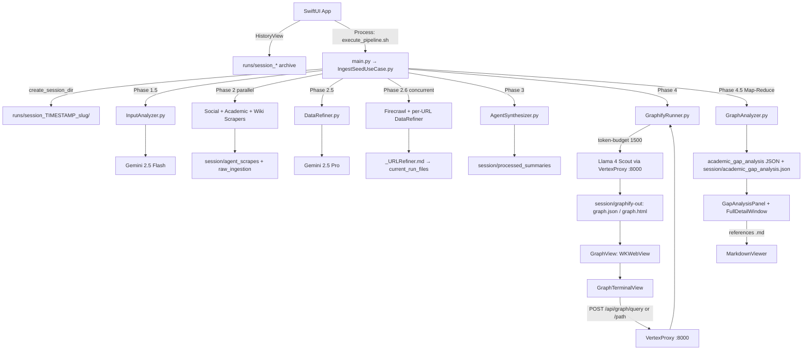

# Project Specification: Autonomous Research Graph (macOS)

## 1. Project Vision

An **Academic Gap-Hunting Engine** designed to automate deep-dive domain research for university-level Final Year Projects (FYP). The system identifies research opportunities by correlating:

* **Societal problems** (from social media and web discovery),
* **Academic limitations** (from peer-reviewed papers),
* **Knowledge-graph topology** (communities, high-degree nodes, and failure-linked solutions),

and surfaces **actionable FYP angles** with **source-verifiable citations** back to the original Markdown corpus.

Simply rendering a knowledge graph is not sufficient. Phase **4.5 (Academic Graph Analyzer)** actively guides students on *how* to read graph topology—structural holes, validated limitation nodes, and orphaned solutions—grounded in the full source text of the current pipeline run.

The workbench also provides **workspace run isolation** (every execution writes to a dedicated timestamped folder) and an **interactive Graph Explorer Console** (`graphify query` / `graphify path`) for live topology interrogation against any historical session.

---

## 2. Technology Stack & Environment

| Layer | Technology |
|-------|------------|
| **Platform** | macOS (optimized for Apple Silicon) |
| **Frontend** | SwiftUI (`@Observable`), `WKWebView` (Graphify HTML), native Markdown viewer, `URLSession` → VertexProxy graph APIs |
| **Backend** | Python 3.10+, subprocess bridge via `execute_pipeline.sh` → `main.py` |
| **Local proxy** | `VertexProxy.py` (FastAPI on port 8000) — OpenAI-compatible bridge to Vertex AI; hosts `/api/graph/*` interactive endpoints |

### AI Models

| Model | Role |
|-------|------|
| **Gemini 2.5 Flash** | Phase 1.5 input analysis; Phase 2.6 high-value URL extraction; post-Graphify community naming |
| **Gemini 2.5 Pro** | Phase 2.5 noise refinement; Phase 3 synthesis; **Phase 4.5 Map-Reduce gap analysis** (3 parallel category calls + executive summary) |
| **Llama 4 Scout** | Phase 4 knowledge-graph extraction (10M context via VertexProxy) |

### Data Ingestion APIs

* **Firecrawl** — Local Docker container for deep web crawling (`/crawl`, `/scrape`)
* **Semantic Scholar API** — Academic citations, limitations, future work
* **Tavily API** — Social leads (Reddit/X) and academic fallbacks
* **MediaWiki API** — Foundational definitions and Wiki context

---

## 3. Core Architecture & Data Flow

The system operates as a recursive, concurrent pipeline with **strict session isolation**. Each run:

1. Allocates a dedicated directory under `research_knowledge_base/runs/session_<TIMESTAMP>_<slug>/`
2. Pins that absolute path in `RESEARCHBOT_SESSION_DIR` for the lifetime of the process
3. Builds an in-memory `current_run_files` queue (absolute `Path` objects) that feeds Phase 4 Graphify and Phase 4.5 analysis—never mixing artifacts from prior runs



### Execution Bridge

```
SwiftUI (PythonBridge)
    ├── HistoryView — enumerate runs/session_* on disk; load historical graph + gap JSON
    ├── InputView — runPipeline(idea:) → Process
    └── GraphTerminalView — URLSession POST → VertexProxy /api/graph/query|path

execute_pipeline.sh [--idea "..."] [--url "..."]
    ├── Activates Backend/.venv
    ├── Starts VertexProxy (uvicorn :8000) if not running
    └── python3 main.py → IngestSeedUseCase.execute()
            ├── FileStorage.create_session_dir(idea)  → RESEARCHBOT_SESSION_DIR
            └── stdout: PROGRESS lines + ---PIPELINE_RESULT_START--- JSON
```

---

## 4. Pipeline Phases (Backend)

All on-disk outputs below are relative to the **active session directory**:

`research_knowledge_base/runs/session_<UTC_TIMESTAMP>_<slug>/`

### Phase 1 & 1.5: Ingestion & Intent Analysis

| Item | Detail |
|------|--------|
| **Entry** | `InputAnalyzer.analyze_seed(raw_seed)` |
| **Model** | Gemini 2.5 Flash (global + `STABLE_REGIONS` failover) |
| **Outputs** | `core_context`, `search_keywords`, `extracted_urls`, `user_intent` (in-memory only until later phases write files) |
| **Swift input** | User topic via `--idea`; optional `--url` appended to seed |

### Phase 2: Discovery Scraping (Concurrent)

| Scraper | Module | Output location (within session) |
|---------|--------|----------------------------------|
| Firecrawl (sequential first) | `WebScraper.py` | `agent_scrapes/` |
| Social (parallel) | `SocialScraper.py` | `raw_ingestion/` |
| Academic (parallel) | `AcademicScraper.py` | `agent_scrapes/` |
| Wiki (parallel) | `WikiAPI.py` | `agent_scrapes/` |

* **Concurrency:** `ThreadPoolExecutor` with `_PHASE2_WORKERS = 3`
* Every saved scrape is appended to `current_run_files` via `path.resolve()`
* **API:** `save_markdown(subdir_key, topic, content, session_dir=...)`

### Phase 2.5: Noise Reduction & Primary Refinement

| Item | Detail |
|------|--------|
| **Module** | `DataRefiner.refine_scraped_data(raw_corpus)` |
| **Model** | Gemini 2.5 Pro (`max_output_tokens=65536`) |
| **Input** | In-memory corpus only: `web_md`, `social_md`, `wiki_md`, `academic_md`, `deep_crawl_md` |
| **Output** | Clean Markdown research ledger in `agent_scrapes/`; section **"High-Value URLs for Next Crawl Phase"** |
| **Failure** | `RuntimeError` on regional exhaustion → orchestrator skips corrupt file write |

### Phase 2.6: Recursive Deep-Crawl & URL Refinement

| Item | Detail |
|------|--------|
| **URL extraction** | Gemini 2.5 Flash parses Phase 2.5 output → `Title [URL]` lines |
| **Per-URL worker** | `deep_crawl_urls` → `refine_scraped_data` → `save_markdown(..., *_URLRefiner, session_dir=...)` |
| **Concurrency** | `ThreadPoolExecutor`, `_PHASE26_MAX_WORKERS = 5`, `threading.Lock` on `current_run_files` |
| **Anti-bot guard** | Skips payloads containing captcha / 403 / empty-scrape indicators |
| **Naming** | Files use `_URLRefiner` suffix for Phase 4 visibility and HistoryView metrics |

### Phase 3: Synthesis & Storage

| Item | Detail |
|------|--------|
| **Module** | `AgentSynthesizer.synthesize_context(full_context)` |
| **Context contract** | **Only** `core_context` + `user_intent` + `refined_data` (no disk re-reads) |
| **Rubric sections** | Problem Background, Existing Solutions, Methodological Weaknesses (The Gap), Proposed Novelty |
| **Output** | `processed_summaries/<topic>_<timestamp>.md` → registered in `current_run_files` |

### Phase 4: Knowledge Graph Generation (Micro-Extraction Protocol)

| Item | Detail |
|------|--------|
| **Module** | `GraphifyRunner.run_graphify(current_run_files, session_dir=...)` |
| **Session isolation** | Temp dir `session_dir/temp_graph_input/` with only current-run refined Markdown; artefacts land in `session_dir/graphify-out/` |
| **Inclusion rules** | Academic refinement summary, `processed_summaries`, `# Wiki:` / `# Wikipedia:` headers, `*_URLRefiner.md`, `agent_scrapes` refinement outputs |
| **Extraction** | Graphify CLI via `OLLAMA_BASE_URL=http://localhost:8000/v1` → VertexProxy → **Llama 4 Scout** |
| **Token budget** | `--token-budget` from `GRAPHIFY_TOKEN_BUDGET` env (default `4096`) |
| **Post-processing** | Resizable sidebar injection in `graph.html`; Gemini 2.5 Flash community naming patched into `graph.json` + `graph.html` |
| **Artifacts** | `session_dir/graphify-out/` only — never the legacy shared root |

**Graphify outputs (per session):**

| File | Purpose |
|------|---------|
| `graph.json` | Full node/link/community data (Phase 4.5 input) |
| `graph.html` | Interactive visualization (Swift `WKWebView`) |
| `GRAPH_REPORT.md` | Structural report for agents / manual review |

**`graph.json` structure (relevant fields):**

```json
{
  "nodes": [
    { "id": "...", "label": "...", "community": 0, "community_name": "...", "type": "..." }
  ],
  "links": [
    { "source": "...", "target": "...", "type": "..." }
  ]
}
```

### Phase 4.5: Academic Graph Topology Analysis (Map-Reduce, Full-Corpus)

Phase 4.5 avoids a single monolithic Gemini call over the full graph + corpus (high latency and regional burst quotas). Instead it uses **async Map-Reduce**: three specialized category analyses run in parallel, then a lightweight fourth call merges an executive summary.

| Item | Detail |
|------|--------|
| **Module** | `GraphAnalyzer.analyze_graph_topology(current_run_files, graph_json_path=...)` |
| **Graph input** | `session_dir/graphify-out/graph.json` (passed explicitly by orchestrator) |
| **Entry** | Sync wrapper; inner orchestration via `asyncio.run(_run_map_reduce_analysis_async(...))` |
| **Trigger** | `IngestSeedUseCase` after successful Phase 4 only |
| **Model** | Gemini 2.5 Pro (`response_mime_type=application/json`) |
| **Inputs** | (A) Complete `graph.json` topology — **all nodes, all edges, all communities** (no artificial truncation). (B) Full Markdown corpus from `current_run_files` under `--- SOURCE DOCUMENTS ---` |
| **Corpus I/O** | `_load_source_corpus_async()` — concurrent per-file reads via `asyncio.gather` + `asyncio.to_thread` |
| **Per-file safety** | `_MAX_CHARS_PER_FILE = 120_000` tail-trim only for extreme single-file outliers |
| **Reference hygiene** | `_sanitize_references()` drops any filename not present in the loaded corpus |
| **Persistence** | Orchestrator writes `session_dir/academic_gap_analysis.json` for HistoryView reload |

**Map tasks (3 parallel `asyncio.gather` calls):**

| Task | Prompt focus | JSON key | Start region | Failover chain |
|------|----------------|----------|--------------|----------------|
| A | Structural Holes only | `structural_holes` | `europe-west4` | → `us-central1` → `us-east4` → `asia-northeast1` |
| B | High-Degree Limitations only | `high_degree_limitations` | `us-east4` | → `asia-northeast1` → `us-central1` → `europe-west4` |
| C | Orphaned Solutions only | `orphaned_solutions` | `asia-northeast1` | → `us-central1` → `europe-west4` → `us-east4` |

Each map task receives the same payload sections:

```
_PROMPT_<CATEGORY>
--- GRAPH TOPOLOGY ---   (full _build_topology_summary)
--- SOURCE DOCUMENTS --- (<<<FILE: name>>> ... <<<END FILE>>> blocks)
```

* `max_output_tokens=16384` per category call.
* Vertex `generate_content` runs in `asyncio.to_thread` (sync SDK, async orchestration).
* Per-task 429 / `ResourceExhausted` → retry next region in that task’s chain only; other concurrent tasks are unaffected.

**Reduce step (sequential, after gather):**

| Step | Detail |
|------|--------|
| **Merge** | `_merge_analysis_results()` combines the three category arrays into one `academic_gap_analysis` object |
| **Summary** | `_generate_executive_summary_async()` — fourth call on a compact findings digest (`max_output_tokens=2048`); regions: `global` → `us-central1` → `europe-west4` → `us-east4` |
| **Fallback** | If summary regions exhaust, `_fallback_summary_from_findings()` builds text from top entries |

**Three academic indicators (one per map task):**

1. **Structural Holes** — Loosely connected or disconnected communities; bridging FYP opportunities.
2. **High-Degree Limitation Nodes** — Limitation/challenge nodes with multi-source incoming evidence.
3. **Orphaned Solutions** — Solution nodes with outgoing edges to failure/drawback conditions.

**Stdout progress examples:**

```
PROGRESS: Session — workspace allocated at .../runs/session_20260520T235831Z_topic_slug
PROGRESS: Phase 4.5 — Map-Reduce: 3 parallel category analyses + executive summary...
PROGRESS: Phase 4.5 — loaded N source files (async I/O).
PROGRESS: Phase 4.5 — routing Structural Holes to europe-west4...
PROGRESS: Phase 4.5 — ✓ High-Degree Limitations complete via us-east4 (4 entries).
PROGRESS: Phase 4.5 — ✓ academic gap analysis complete.
```

### Session Manifest (orchestrator-written)

After Phase 3, `IngestSeedUseCase` writes `session_dir/session_manifest.json`:

```json
{
  "session_id": "session_20260520T235831Z_ai_agents_for_automated_code_review",
  "topic": "user seed idea",
  "primary_keyword": "first search keyword",
  "user_intent": "General Inquiry",
  "saved_files": ["absolute paths..."],
  "url_refiner_count": 22,
  "created_at": "20260520T235831Z"
}
```

---

## 5. Knowledge Base Layout

```
/research_knowledge_base/          # Single KB root (sibling to Backend/)
└── runs/                          # All pipeline executions (canonical, isolated)
    └── session_<UTC_TIMESTAMP>_<slug>/
        ├── agent_scrapes/         # Web, Wiki, Academic, URLRefiner, Phase 2.5 refinement
        ├── raw_ingestion/         # Social scraper dumps
        ├── processed_summaries/   # Phase 3 synthesis Markdown
        ├── graphify-out/          # Phase 4 artefacts (gitignored)
        │   ├── graph.json
        │   ├── graph.html         # RAW_NODES must include every graph.json node id
        │   └── GRAPH_REPORT.md
        ├── session_manifest.json  # HistoryView metadata
        └── academic_gap_analysis.json  # Persisted Phase 4.5 payload
```

Stray `graphify-out/` directories outside `runs/session_*/graphify-out/` are removed by `cleanup_repo_layout.sh`.

**Session allocation (`FileStorage.create_session_dir`):**

* Creates `runs/session_<YYYYMMDDTHHMMSSZ>_<sanitized_topic>/` with all four `SESSION_SUBDIRS` pre-created
* Sets `os.environ["RESEARCHBOT_SESSION_DIR"]` to the absolute path (immutable for that process)
* Helpers: `list_sessions()`, `resolve_session_dir(session_id)`, `session_id_from_path()`

Historical sessions under `runs/` are preserved unless the user explicitly requests cleanup (`clean_kb.sh`, which clears contents of each top-level KB subfolder including `runs/`).

---

## 6. Swift Bridging Contract

### Stdout markers

Python prints the final payload between:

```
---PIPELINE_RESULT_START---
{ ... JSON ... }
---PIPELINE_RESULT_END---
```

Live progress lines (`PROGRESS: Phase X — ...`) are streamed to the Swift console during execution.

### Success payload schema (`main.py` / `IngestSeedUseCase`)

| Key | Type | Description |
|-----|------|-------------|
| `status` | string | `"success"` or `"error"` |
| `message` | string | Human-readable result |
| `graph_path` | string | Absolute path to `session_dir/graphify-out/graph.html` |
| `kb_root` | string | Absolute path to `research_knowledge_base/` (for Markdown resolution) |
| `session_id` | string | Session directory basename (e.g. `session_20260520T235831Z_topic`) |
| `session_path` | string | Absolute path to the isolated session workspace |
| `phase` | string | Last completed phase label |
| `seed_analysis` | object | `core_context`, `search_keywords`, `extracted_urls`, `user_intent` |
| `saved_files` | string[] | All artifact paths written this run (under `session_path`) |
| `synthesis_preview` | string | First 500 chars of Phase 3 synthesis |
| `graphify` | object | `{ ran, stdout, error }` |
| `academic_gap_analysis` | object | Phase 4.5 structured insights (see below) |

### `academic_gap_analysis` schema

```json
{
  "summary": "Executive summary (2–4 sentences, from reduce-step digest call)",
  "structural_holes": [
    {
      "title": "string",
      "communities_involved": ["string"],
      "description": "string",
      "bridging_opportunity": "string",
      "references": ["exact_filename.md"]
    }
  ],
  "high_degree_limitations": [
    {
      "title": "string",
      "node_labels": ["string"],
      "degree": 0,
      "description": "string",
      "evidence": "string",
      "references": ["exact_filename.md"]
    }
  ],
  "orphaned_solutions": [
    {
      "title": "string",
      "failure_conditions": ["string"],
      "description": "string",
      "technical_contribution": "string",
      "references": ["exact_filename.md"]
    }
  ],
  "source_files": ["all filenames provided to the LLM"],
  "error": "optional string if analysis partially failed"
}
```

On Graphify failure, the orchestrator still returns a valid object with empty category arrays and an `error` message so Swift decoding never breaks.

### Interactive Graph API (VertexProxy :8000)

Registered **before** the OpenAI catch-all proxy route. Swift `GraphTerminalView` calls these via `URLSession`; Python `GraphifyRunner` shells out to the Graphify CLI.

| Method | Path | Body | Response |
|--------|------|------|----------|
| `GET` | `/api/graph/sessions` | — | `{ "sessions": ["session_...", ...] }` |
| `POST` | `/api/graph/query` | `{ "session_id", "question" }` | `{ "ok": true, "stdout": "..." }` or `{ "ok": false, "error": "..." }` |
| `POST` | `/api/graph/path` | `{ "session_id", "source", "target" }` | `{ "ok": true, "stdout": "..." }` or `{ "ok": false, "error": "..." }` |

**CLI mapping (`GraphifyRunner`):**

```
graphify query  <session_dir/graphify-out>  "<question>"
graphify path   <session_dir/graphify-out>  "<source>"  "<target>"
```

`session_id` resolves via `FileStorage.resolve_session_dir()` (full dirname, timestamp prefix, or partial match).

**Macro presets (GraphTerminalView):**

| UI control | Submitted question / action |
|------------|----------------------------|
| Extract Core Gaps | `"What are the most commonly cited limitations or future work recommendations in the scraped academic papers?"` |
| Problem Intersection | `"How does the societal problem intersect with the limitations of current technologies?"` |
| Find Contribution Path | `POST /api/graph/path` with Source Node + Target Node fields |

VertexProxy must remain running (started by `execute_pipeline.sh`) for live console queries from the app.

---

## 7. SwiftUI Frontend Architecture

**Boundary rule:** Swift handles layout, navigation, process spawning, HTTP to VertexProxy graph endpoints, and file display only. No scraping, no LLM calls, no graph extraction in Swift.

### Module map

| File | Responsibility |
|------|----------------|
| `ResearchBotApp.swift` | App entry |
| `ContentView.swift` | `AppScreen` routing: History → Input → Graph |
| `HistoryView.swift` | Landing dashboard; enumerates `runs/session_*`; loads historical graph + gap JSON |
| `PythonBridge.swift` | `Process()` → `execute_pipeline.sh`; parses `PipelineResult`; `URLSession` graph console |
| `GraphTerminalView.swift` | Interactive console: macros, path finder, transcript |
| `GapAnalysisPanel.swift` | Concise right-side summary (metrics + CTA) |
| `FullDetailWindow.swift` | Sheet: full gap breakdown + reference navigation |
| `MarkdownViewer.swift` | Native Markdown reader for source verification |

### Screen flow

```
HistoryView (initial landing)
  ├── Card grid: timestamp, topic, URLRefiner count, session id
  ├── Tap card → PythonBridge.loadHistoricalSession() → GraphView
  └── "New Research" → InputView

InputView
  └── Run Research → PythonBridge.runPipeline(idea:)
        └── on graph_path + success → GraphView

GraphView (HSplitView + optional bottom console)
  ├── GraphWebView (WKWebView → session/graphify-out/graph.html)
  ├── GraphTerminalView (toggle via toolbar "Console")
  │     ├── Macros: Extract Core Gaps, Problem Intersection
  │     ├── Path finder: Source / Target → /api/graph/path
  │     └── Custom query → /api/graph/query
  └── GapAnalysisPanel
        ├── Executive summary
        ├── Metric chips (hole / limitation / orphaned counts)
        └── "View Full Analysis" → .sheet(FullDetailWindow)

FullDetailWindow (NavigationStack)
  ├── Category cards with references as clickable capsules
  ├── Indexed Sources footer
  └── on reference tap → MarkdownViewer (in-place push)

MarkdownViewer
  ├── Resolves filename under kb_root (recursive search, including session subfolders)
  ├── Lightweight MarkdownParser (headings, bullets, code, quotes)
  ├── Toolbar: Back → FullDetailWindow, Reveal in Finder
```

### `PythonBridge` observable state

| Property | Source |
|----------|--------|
| `isRunning` | Process lifecycle |
| `progress` | Accumulated stdout |
| `graphFilePath` | `graph_path` |
| `kbRoot` | `kb_root` |
| `sessionId` | `session_id` |
| `sessionPath` | `session_path` |
| `academicGapAnalysis` | `academic_gap_analysis` or `session_dir/academic_gap_analysis.json` (historical load) |
| `synthesisPreview` | `synthesis_preview` |
| `errorMessage` | `status == "error"` or decode failure |

**Historical reload:** `loadHistoricalSession(_:)` sets `graphFilePath`, `sessionId`, `sessionPath`, `kbRoot`, and decodes `academic_gap_analysis.json` from the session folder.

**Graph console:** `runGraphQuery(question:)` and `runGraphPath(source:target:)` POST to `http://localhost:8000/api/graph/...` (300s timeout).

### Codable models (`GapAnalysisPanel.swift`)

* `AcademicGapAnalysis` — root payload
* `StructuralHole`, `HighDegreeLimitation`, `OrphanedSolution` — category entries with optional `references: [String]`
* `PipelineResult` — includes `sessionId`, `sessionPath` (`PythonBridge.swift`)

---

## 8. Python Backend Module Map

```
Backend/
├── main.py                          # CLI entry; PIPELINE_RESULT envelope
├── application/
│   ├── IngestSeedUseCase.py         # Orchestrator; create_session_dir; manifest + gap JSON persist
│   ├── InputAnalyzer.py             # Phase 1.5
│   ├── DataRefiner.py               # Phase 2.5
│   ├── AgentSynthesizer.py          # Phase 3
│   └── GraphAnalyzer.py             # Phase 4.5 (Map-Reduce, async corpus I/O)
└── infrastructure/
    ├── VertexProxy.py               # FastAPI :8000; /api/graph/* + OpenAI proxy
    ├── GraphifyRunner.py            # Phase 4; execute_graph_query; execute_graph_path
    ├── FileStorage.py               # Session dirs, save_markdown, RESEARCHBOT_SESSION_DIR
    ├── WebScraper.py                # Firecrawl
    ├── SocialScraper.py
    ├── AcademicScraper.py
    └── WikiAPI.py
```

**Root scripts (ResearchGraphApp/):**

| Script | Role |
|--------|------|
| `execute_pipeline.sh` | venv activate, VertexProxy lifecycle, `main.py "$@"` |
| `run.sh` | GCP + Firecrawl checks, Xcode build, launch `.app` (no graph path verification) |
| `clean_kb.sh` | Deep-clean contents of each top-level KB subfolder (including `runs/`) |
| `test_backend.sh` | Full pipeline smoke test; verifies artefacts via `session_path` from PIPELINE_RESULT JSON |

---

## 9. Performance & High-Availability Protocols

### Multi-Region Failover (`STABLE_REGIONS`)

Used by `VertexProxy` (pinned models), `DataRefiner`, `AgentSynthesizer`, `InputAnalyzer` (URL extraction), and `IngestSeedUseCase`.

**GraphAnalyzer (Phase 4.5)** uses **per-category regional sharding** (see Phase 4.5 table) instead of a single global → `STABLE_REGIONS` waterfall. The executive-summary call uses its own smaller region plan starting at `global`.

**Other modules** — primary: `global` → sequential failover:

* `europe-west4`
* `us-east4`
* `asia-northeast1`
* `us-central1`

**Pinned models** (`gemini-2.5-pro`, `llama-4-scout`) are never pool-rotated in VertexProxy.

### Concurrency

| Phase | Mechanism | Parallelism |
|-------|-----------|-------------|
| 2 | `ThreadPoolExecutor` | 3 (Social, Academic, Wiki) |
| 2.6 | `ThreadPoolExecutor` + `Lock` | 5 URL refine workers |
| 4.5 | `asyncio.gather` + `asyncio.to_thread` | 3 category map tasks; async corpus reads; 1 summary call after merge |

### Rate-limit & fail-fast

* DataRefiner exhaustion → `RuntimeError` → orchestrator skips corrupt markdown writes
* GraphAnalyzer: per-category regional failover; partial map failure → empty array for that category + `error` string; total map failure → `_empty_analysis()`; graph still loads in UI

---

## 10. Development & Contribution Rules

### Code generation rules

1. **Strict separation** — Swift: UI + `Process` management + graph HTTP. Python: APIs, scraping, LLM, Graphify, gap analysis. Do not mix environments.
2. **SwiftUI state** — Use `@Observable` on `PythonBridge`. Stream stdout for live console in `InputView`.
3. **No unapproved commits** — No `git commit` or `git push` without explicit user authorization in chat.

### Workspace run isolation rules

1. **Session-first writes** — Every `save_markdown` and Graphify artefact must target `runs/session_<TIMESTAMP>_<slug>/` only. No top-level KB subfolders besides `runs/`.
2. **Immutable session env** — `RESEARCHBOT_SESSION_DIR` is set once at `create_session_dir()` and must not be overwritten mid-run.
3. **Corpus fidelity** — `current_run_files` must only contain paths under the active session (or in-memory equivalents before write).
4. **Historical preservation** — Do not delete `runs/session_*` directories unless the user explicitly requests cleanup.
5. **Verification** — `test_backend.sh` must parse `session_path` from PIPELINE_RESULT JSON; do not verify the legacy `research_knowledge_base/graphify-out/` path alone.

### Graphify integration rules

1. **Report monitoring** — Consult `session_dir/graphify-out/GRAPH_REPORT.md` for structural holes and central nodes.
2. **Incremental updates** — Run `graphify update` locally for structural additions without re-running extraction.
3. **Interactive queries** — Use `execute_graph_query` / `execute_graph_path` (or HTTP wrappers) scoped to `session_dir/graphify-out/` only.

### Phase 4.5 / gap-analysis rules

1. **Corpus fidelity** — Always pass `current_run_files` from the orchestrator; pass `graph_json_path=session_dir/graphify-out/graph.json`.
2. **Reference integrity** — Only filenames actually loaded in `_load_source_corpus_async` may appear in `references`; Python sanitizes LLM output before bridging.
3. **Map-Reduce contract** — Do not collapse Phase 4.5 back into a single mega-prompt; keep three category-specific map tasks plus the digest-based summary reduce step.
4. **Regional isolation** — A 429 in one category’s region must only advance that task’s failover chain, not block sibling `asyncio.gather` tasks.
5. **UI layering** — Summary metrics in `GapAnalysisPanel`; deep content and source links in `FullDetailWindow` + `MarkdownViewer`.
6. **Persist for HistoryView** — Write `academic_gap_analysis.json` beside the session graph so archival runs reload without re-running Phase 4.5.

### File system integrity

1. **Folder preservation** — `clean_kb.sh` clears contents inside top-level KB subfolders but preserves the folder structure.
2. **No data deletion** — Do not purge `runs/session_*` unless explicitly requested.

---

## 11. Environment & Prerequisites

| Requirement | Notes |
|-------------|-------|
| `GOOGLE_CLOUD_PROJECT_ID` | Vertex AI / Gemini (ADC) |
| `.env` at repo root | Loaded by Backend modules and `execute_pipeline.sh` |
| `Backend/.venv` | Python dependencies for pipeline + tests |
| VertexProxy on `:8000` | Auto-started by `execute_pipeline.sh`; required for GraphTerminalView |
| Firecrawl Docker | Phase 2 / 2.6 crawling |
| Graphify CLI | Phase 4 + interactive query/path |
| Xcode 26+ | macOS app target `ResearchBot` |

Optional environment variables:

| Variable | Purpose |
|----------|---------|
| `BRIDGE_SCRIPT_PATH` | Overrides `execute_pipeline.sh` location for Xcode schemes |
| `RESEARCHBOT_SESSION_DIR` | Set by Python orchestrator; absolute active session path |
| `RESEARCHBOT_KB_ROOT` | Optional override for Swift `HistoryView` KB discovery |
| `GRAPHIFY_TOKEN_BUDGET` | Per-chunk Graphify extraction budget (default `4096`) |

---

## 12. Quick Reference: Phase → File → Output

| Phase | Primary module | Key output (under `runs/session_<ts>_<slug>/`) |
|-------|----------------|------------------------------------------------|
| 0 | `FileStorage.create_session_dir` | Session workspace + `RESEARCHBOT_SESSION_DIR` |
| 1.5 | `InputAnalyzer.py` | Seed analysis JSON (in-memory) |
| 2 | Scrapers + `WebScraper` | `agent_scrapes/*.md`, `raw_ingestion/*.md` |
| 2.5 | `DataRefiner.py` | Refined ledger in `agent_scrapes/` |
| 2.6 | `IngestSeedUseCase` workers | `*_URLRefiner.md` in `agent_scrapes/` |
| 3 | `AgentSynthesizer.py` | `processed_summaries/*.md` |
| 3b | `IngestSeedUseCase` | `session_manifest.json` |
| 4 | `GraphifyRunner.py` | `graphify-out/graph.{json,html}` |
| 4.5 | `GraphAnalyzer.py` | `academic_gap_analysis` JSON (+ persisted `.json`) |
| UI | `HistoryView` | Archive browser + historical graph reload |
| UI | `GraphTerminalView` | Live `graphify query` / `path` via VertexProxy |
| UI | `ContentView` + panels | Graph + gap summary + source viewer |
