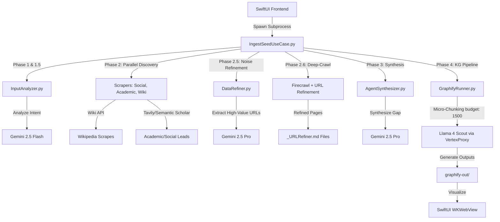

# Project Specification: Autonomous Research Graph (macOS)

## 1. Project Vision
An **Academic Gap-Hunting Engine** designed to automate deep-dive domain research for university-level Final Year Projects (FYP). The system identifies "Structural Holes" in existing literature by correlating societal problems (extracted from social media) with academic limitations (from peer-reviewed papers), providing a clear path for a novel technical contribution.

## 2. Technology Stack & Environment
* **Platform:** macOS (optimized for Apple Silicon).
* **Frontend UI:** SwiftUI (Modern `@Observable` state management, WKWebView for visualization).
* **Backend Orchestrator:** Python 3.10+ (Subprocess execution from Swift).
* **AI Models:**
    * **Gemini 2.5 Flash:** Input analysis, lead extraction, and high-speed URL parsing.
    * **Gemini 2.5 Pro:** Data refinement, noise reduction, and final synthesis (utilizing 64k output window).
    * **Llama 4 Scout:** 10M-context Knowledge Graph generation via Vertex AI Model-as-a-Service (MaaS) mapped locally via VertexProxy.
* **Data Ingestion APIs:**
    * **Firecrawl:** Local Docker container for deep web crawling (`/crawl` and `/scrape`).
    * **Semantic Scholar API:** Direct extraction of academic citations, limitations, and future work.
    * **Tavily API:** Discovery of social leads (Reddit/X) and academic fallbacks.
    * **MediaWiki API:** Foundational definitions and Wiki context.

---

## 3. Core Architecture & Data Flow
The system operates as a recursive, concurrent pipeline with strict session isolation.



### Phase 1 & 1.5: Ingestion & Intent Analysis
* SwiftUI passes raw input to `InputAnalyzer.py`.
* Gemini 2.5 Flash generates `core_context`, `search_keywords`, and `user_intent`.

### Phase 2: Discovery Scraping (Concurrent Execution)
* **Social Scraper:** Captures Reddit/X threads; extracts "leads" (Wikipedia/GitHub/Research terms).
* **Academic Scraper:** Queries Semantic Scholar/arXiv for the top 20 papers; extracts Current Work, Limitations, and Citations.
* **Wiki Context:** Extracts background logic from MediaWiki using the standard `WikiAPI`.

### Phase 2.5: Noise Reduction & Primary Refinement
* **DataRefiner:** Ingests raw Discovery data into Gemini 2.5 Pro.
* **Logic:** Strips ads and fluff; organizes findings into a "Research Ledger" with source tags.
* **Output:** Generates the "High-Value URLs for Next Crawl Phase."

### Phase 2.6: Recursive Deep-Crawl & URL Refinement
* **URL Extraction:** Gemini 2.5 Flash extracts URLs from Phase 2.5.
* **Recursive Loop & Queue Registration:** High-value discovered URLs are deep-crawled via Firecrawl and individually refined via Gemini 2.5 Pro.
* **Data Leak Mitigation:** Each scraped and refined markdown file is saved to `/research_knowledge_base/agent_scrapes` and immediately registered via absolute path resolution (`path.resolve()`) into the dynamic run queue (`current_run_files`). This ensures 100% corpus capture during Phase 4.

### Phase 3: Synthesis & Storage
* **AgentSynthesizer:** Ingests `core_context`, `user_intent`, and `refined_data`.
* **Output:** Strictly follows the University Rubric: `## Problem Background`, `## Existing Solutions`, `## Methodological Weaknesses (The Gap)`, and `## Proposed Novelty`.
* Raw data and syntheses are saved strictly as `.md` files in the local `/research_knowledge_base` directory structure:
    ```
    /research_knowledge_base
        ├── /raw_ingestion (Reddit/Twitter dumps)
        ├── /agent_scrapes (Raw Markdown from websites & URLRefiner outputs)
        ├── /processed_summaries (Intermediate JSON files)
    ```

### Phase 4: Knowledge Graph Generation (Micro-Extraction Protocol)
* **Session Isolation:** A temporary directory is constructed containing strictly the current execution run's files copied from `processed_summaries`, `_urlrefiner` files, and validated scrapes.
* **Micro-Extraction Chunking:** Llama 4 Scout processes the entire filtered corpus via the local VertexProxy. The token budget parameter is tuned to `--token-budget 1500` (down from `8000`). This splits the corpus into small semantic windows, forcing the model to perform highly granular micro-extraction of niche gaps, definitions, and relationships rather than macro-summarizing the entire corpus into a sparse handful of nodes.
* **Header Matching Bugfix:** The compilation step accurately matches both `# Wikipedia:` and `# Wiki:` headers, preventing scrape omission during folder synchronization.
* **Visualization Output:** Graphify compiles the extracted entities and links into `graph.json`, `graph.html`, and `GRAPH_REPORT.md`, moving them to `/research_knowledge_base/graphify-out/` where they are loaded into the SwiftUI WKWebView.

---

## 4. Performance & High-Availability Protocols

### 1. Multi-Region Fallover Pools (Rate-Limit Mitigation)
To prevent API interruption from `429 RESOURCE_EXHAUSTED` errors during parallel processing, both `DataRefiner.py` and `AgentSynthesizer.py` employ a Multi-Region Redundancy Pool matching `VertexProxy.STABLE_REGIONS`. If the primary global endpoint fails, the pipeline cycles sequentially through:
* `europe-west4`
* `us-east4`
* `asia-northeast1`
* `us-central1`

### 2. Thread-Level Concurrency Enforcements
* **Phase 2 Scrapers:** Executed concurrently via `ThreadPoolExecutor` (Max Workers capped to protect API rate limits).
* **Phase 2.6 Deep Scrapers:** Executed concurrently to parse and refine multiple crawled pages simultaneously.

### 3. Swift Bridging & Standard Output Stream
* Python scripts stream structured logs directly to `stdout`.
* The final execution outputs the SwiftUI bridging payload wrapped in explicit JSON tokens: `---PIPELINE_RESULT_START---` and `---PIPELINE_RESULT_END---`.

---

## 5. Development & Contribution Rules

### Code Generation Rules
1. **Strict Separation:** Swift handles UI layout and process state; Python manages all API connections, model querying, scraping, and knowledge graph orchestration. Do not mix environments.
2. **SwiftUI State Standards:** Use modern `@Observable` state management. Direct standard output monitoring is used for live console updates in the app UI.
3. **No Unapproved Commits:** Under **RULE[user_global]**, absolutely no git commits or pushes may be executed without explicit user authorization in the chat interface.

### Graphify Integration Rules
1. **Report Monitoring:** Antigravity must consult `/research_knowledge_base/graphify-out/GRAPH_REPORT.md` to identify structural holes, communities, and highly connected central nodes before advising on literature positioning or codebase modifications.
2. **Incremental Updates:** Keep the graphify environment optimized. Run `graphify update` locally for structural additions without incurring extraction model cost.

### File System Integrity
1. **Folder Preservations:** The clean utilities must preserve the top-level research directory architecture while deep cleaning inner files.
2. **No Data Deletion:** Do not purge or modify historical research ledgers unless explicitly requested by the user.